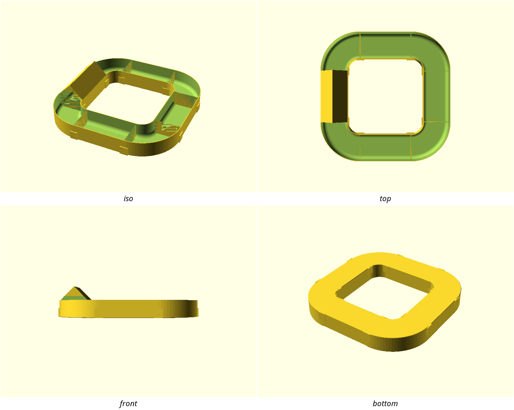

# print-bench

Co-designed, review-hardened, printable: parametric 3D-printing designs
written in [OpenSCAD](https://openscad.org/), iterated with an AI
co-designer, and gated by automated printability checks before they ship.

## The designs

<!-- gallery:begin (generated by scripts/gallery.sh — edit prose outside the markers) -->
| Design | |
|---|---|
| <a href="designs/calibration-cube/"></a> | **[calibration-cube](designs/calibration-cube/)** — Simple dimensional-accuracy test print; also serves as the repo's starter design demonstrating the parameter conventions. |
| <a href="designs/desiccant-capsule/"></a> | **[desiccant-capsule](designs/desiccant-capsule/)** — Refillable two-part capsule for loose silica gel beads, lived-in filament dry-boxes. Perforated body lets air/moisture reach the beads; screw-on lid with real threads (not press-fit) and a ribbed grip edge so it can be opened with dry-box gloves on. Must print on FDM with no supports on either part. |
| <a href="designs/nuggs/"></a> | **[nuggs](designs/nuggs/)** — A short, straight, wide-bore tunnel joining **two** hamster enclosures through their walls, for an adult Syrian. Not a tube *system* and nothing inside the cage — see the dossier for why that framing is deliberate (PLOS One / EXOPET-II rates tube systems unsuitable as a category; this design answers each cited defect individually or omits the part). |
| <a href="designs/nuggs-yard/"></a> | **[nuggs-yard](designs/nuggs-yard/)** — An open-top run for an adult Syrian hamster's **playpen** — free-roam time outside the cage. The ask was "loops and twists, turns, branches, all the stuff to keep him busy". It is a floor-standing kit of modules the owner lays out themselves, not a fixed object. |
| <a href="designs/sushi-battleship/"></a> | **[sushi-battleship](designs/sushi-battleship/)** — Battleship played with real sushi. |
<!-- gallery:end -->

## Want to print one?

1. Open the design's folder above — its `README.md` is the product page:
   what it is, print settings, and the parameters worth tuning for your
   printer. `NOTES.md` holds the engineering log and measurements.
2. Render the STL:

   ```bash
   ./scripts/render.sh <name>   # produces build/<name>.stl and build/<name>.png
   ```

3. Slice `build/<name>.stl` with the settings from the product page. If the
   design ships a `<name>-coupon.scad`, print that first — it's a short
   test print for dialing in the fit parameters before you commit to the
   full part.

All dimensions are in millimeters. Designs target FDM printing by default
and expose printer-tuning parameters (wall thickness, fit tolerances) at
the top of each file. To tune a fit without editing files:

```bash
./scripts/render.sh <name> --sweep thread_tol=0.15:0.35:0.05
```

renders one labeled strip of test coupons across the range instead of five
sequential guess-prints.

## Want it to look a certain way?

Point the toolchain at a model whose look you like and it writes down *why*
it looks that way — the radius reused on its edges, chamfer or fillet, how
smooth its curves are, what size holes it drills — as a style you can build
new designs to and check them against:

```bash
./scripts/style-lift.sh <name> <reference.stl> --source <url> --license <terms>
./scripts/style-check.sh <name>        # does a part actually belong to the family?
```

Styles live in [`styles/`](styles/); pick one from the catalog there and a
design can `include <styles/<name>/style.scad>` to build from its numbers
directly. See [stylelift](tools/stylelift/README.md) for how the measuring
works, and the `/style-spec` skill for lifting a new one.

## Want to remix one?

Keep a design's tray and put your own lid on it. In OpenSCAD that is one
`include` of the original plus a redefinition of the parts you want
different — the original's own code then calls *your* version — so a remix
here is a design directory of its own that stays tied to what it was built
from, not a copy that quietly stops tracking it.

Two things the repo adds to that. Each remix records its parents in a
`derives.conf`, so changing an original automatically re-checks everything
built on it. And every replacement it claims to make is proved against the
original's own export before it can ship: OpenSCAD says nothing at all when
a redefinition misses — misspell the part name and you get a flawless,
watertight print of the part you were trying to replace — so the
replacements are checked rather than trusted.

Start with [docs/derivative-designs.md](docs/derivative-designs.md).

## Dependencies

The scripts expect: `openscad`, `xvfb-run` (headless rendering — the
scripts wrap every OpenSCAD call in `xvfb-run -a` themselves; you only need
the prefix for raw `openscad` commands you run by hand), ImageMagick
(`montage`, for preview sheets), `prusa-slicer` (for `gate.sh --slice`),
Python `bpy` — Blender as an importable module, `pip install 'bpy~=4.5.0'`
(for `product-shot.sh`; its wheels are built per Python minor version, so
this needs Python 3.11) — [printcheck](tools/printcheck/)
(`pip install -e tools/printcheck`), and [stylelift](tools/stylelift/)
(`pip install -e tools/stylelift`, for the style scripts).

A bare `python3` (3.10 or newer) is also required now, not only for those
pip-installed tools: `check.sh` and `gallery.sh` both call `scripts/lineage.sh`,
which runs [lineage](tools/lineage/) straight out of `tools/lineage/src` with no
install step — deliberately, so CI can resolve the lineage graph before it has
installed anything. The consequence for a local checkout is that both scripts
need `python3` on PATH and that directory present; `gallery.sh` fails loudly
rather than quietly dropping the lineage from the page.

## How designs get made

This repo runs a session-per-design co-design loop: a human brings the idea
and the measurements, an AI session models it parametrically, previews are
reviewed after every change, and reviewer personas (printability, and
fitness-for-purpose) challenge the design over pull requests until it
merges. The full workflow and conventions live in [CLAUDE.md](CLAUDE.md).

## Layout

- `designs/<name>/` — one directory per design: the parametric `.scad`
  source (entry point matches the directory name), the `README.md` product
  page, the `NOTES.md` engineering log, and committed `previews/`
- `lib/` — shared modules: `printability.scad` (FDM fastener/chamfer
  helpers), `threads-fdm.scad` (printable trapezoidal threads), each with a
  `*-demo.scad` regression render, plus vendored
  [BOSL2](https://github.com/BelfrySCAD/BOSL2)
- `build/` — generated STL/PNG outputs (gitignored)
- `scripts/` — the toolchain:
  - `render.sh` — STL + 4-view preview sheet; `--previews` re-renders a
    design's frozen review shots, `--sweep` renders tolerance-test strips
  - `check.sh` — fast syntax/geometry validation of every `.scad` file,
    plus the `guard-check.sh`, `mate-check.sh`, `lineage.sh` and
    `docs-check.sh` checks below
  - `guard-check.sh` — negative tests for library guards: every case in a
    `lib/*-guards.conf` must still be refused, which a demo cannot test
    because a firing assert would abort the demo's own render
  - `mate-check.sh` — positive tests for library fits: every case in a
    `lib/*-mates.conf` must still assemble, measured as zero facets of
    interference on the exported mesh. A demo cannot test this either — a
    render cannot measure itself, and echoing the clearance formula only
    proves it equals itself
  - `gate.sh` — render printable parts and gate the STLs with printcheck;
    `--slice` adds a PrusaSlicer test-slice (this is what CI enforces)
  - `gate-summary.py` — turns a gate log into the CI results table
  - `lineage.sh` — who derives from whom: validates the `derives.conf`
    records, answers what a change has to re-gate, and re-proves the
    derivative gate can still fire (`selftest`)
  - `readme-gate.sh` — every design must ship a product-page README
  - `animate.sh` — animated GIF previews from `animations.conf`
  - `product-shot.sh` — real-world-looking studio product shots from
    `shots.conf`, path-traced from the design's own STL export
  - `lifestyle-shot.sh` — tier-2 AI lifestyle shots from `lifestyle.conf`
    via the Z.AI GLM-Image API (cosmetic, geometry-approximate, disclosed)
  - `gallery.sh` — regenerates the design gallery above
  - `site.sh` — builds the static product site into `build/site`
  - `style-lift.sh` — lift a design style out of a reference mesh into
    `styles/<name>/`
  - `style-check.sh` — gate the style packs and any design that declares one
  - `lint-scad.sh` — report-only [sca2d](https://gitlab.com/bath_open_instrumentation_group/sca2d) static analysis
  - `preview-budget.sh` — sourced helper defining the GIF and product-shot
    size budgets
- `site/` — the static product site built from the designs, styles and
  previews already committed here, and deployed on Vercel — see its
  [README](site/README.md)
- `styles/` — design languages lifted from reference models: the spec, the
  tokens a design builds from, and the rules CI checks parts against
- `templates/` — starting points for a new design and its product page
- `docs/` — repo-level research and reference notes
- `tools/printcheck/` — STL printability analyzer; scores rendered models
  for watertightness, overhangs, thin walls, and bed adhesion before
  slicing — see its [README](tools/printcheck/README.md)
- `tools/photoshot/` — STL → Blender/Cycles studio renderer behind
  `product-shot.sh`, which turns a design's own STL export into the
  photographed-looking hero image on its product page — see its
  [README](tools/photoshot/README.md)
- `tools/lineage/` — the lineage resolver: reads each design's
  `derives.conf` and its include lines, and answers who derives from whom —
  see its [README](tools/lineage/README.md)
- `tools/stylelift/` — measures how a model is *shaped* (edge treatment,
  rounding vocabulary, proportion) and turns it into a checkable style
  spec — see its [README](tools/stylelift/README.md)
- `audits/` — preserved before/after render comparisons from design
  reviews (review history — don't delete)
