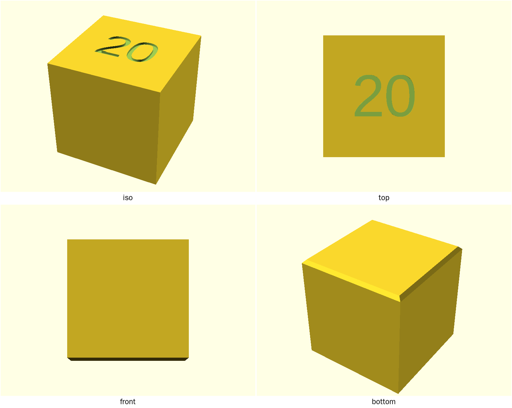
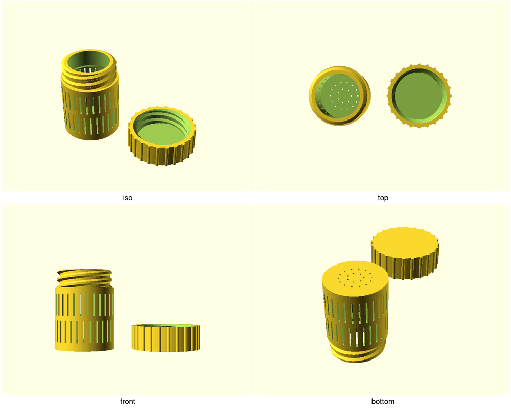

# print-bench

Co-designed, review-hardened, printable: parametric 3D-printing designs
written in [OpenSCAD](https://openscad.org/), iterated with an AI
co-designer, and gated by automated printability checks before they ship.

## The designs

<!-- gallery:begin (generated by scripts/gallery.sh — edit prose outside the markers) -->
| Design | |
|---|---|
| <a href="designs/calibration-cube/"></a> | **[calibration-cube](designs/calibration-cube/)** — Simple dimensional-accuracy test print; also serves as the repo's starter design demonstrating the parameter conventions. |
| <a href="designs/desiccant-capsule/"></a> | **[desiccant-capsule](designs/desiccant-capsule/)** — Refillable two-part capsule for loose silica gel beads, lived-in filament dry-boxes. Perforated body lets air/moisture reach the beads; screw-on lid with real threads (not press-fit) and a ribbed grip edge so it can be opened with dry-box gloves on. Must print on FDM with no supports on either part. |
| <a href="designs/sushi-battleship/"></a> | **[sushi-battleship](designs/sushi-battleship/)** — Battleship played with real sushi. |
<!-- gallery:end -->

## Want to print one?

1. Open the design's folder above — its `README.md` is the product page:
   what it is, print settings, and the parameters worth tuning for your
   printer. `NOTES.md` holds the engineering log and measurements.
2. Render the STL:

   ```bash
   ./scripts/render.sh <name>   # produces build/<name>.stl and build/<name>.png
   ```

3. Slice `build/<name>.stl` with the settings from the product page. If the
   design ships a `<name>-coupon.scad`, print that first — it's a short
   test print for dialing in the fit parameters before you commit to the
   full part.

All dimensions are in millimeters. Designs target FDM printing by default
and expose printer-tuning parameters (wall thickness, fit tolerances) at
the top of each file. To tune a fit without editing files:

```bash
./scripts/render.sh <name> --sweep thread_tol=0.15:0.35:0.05
```

renders one labeled strip of test coupons across the range instead of five
sequential guess-prints.

## Dependencies

The scripts expect: `openscad`, `xvfb-run` (headless rendering — the
scripts wrap every OpenSCAD call in `xvfb-run -a` themselves; you only need
the prefix for raw `openscad` commands you run by hand), ImageMagick
(`montage`, for preview sheets), `prusa-slicer` (for `gate.sh --slice`),
`povray` plus Python `trimesh` (for `product-shot.sh`; trimesh comes with
printcheck), and [printcheck](tools/printcheck/)
(`pip install -e tools/printcheck`).

## How designs get made

This repo runs a session-per-design co-design loop: a human brings the idea
and the measurements, an AI session models it parametrically, previews are
reviewed after every change, and reviewer personas (printability, and
fitness-for-purpose) challenge the design over pull requests until it
merges. The full workflow and conventions live in [CLAUDE.md](CLAUDE.md).

## Layout

- `designs/<name>/` — one directory per design: the parametric `.scad`
  source (entry point matches the directory name), the `README.md` product
  page, the `NOTES.md` engineering log, and committed `previews/`
- `lib/` — shared modules: `printability.scad` (FDM fastener/chamfer
  helpers), `threads-fdm.scad` (printable trapezoidal threads), each with a
  `*-demo.scad` regression render, plus vendored
  [BOSL2](https://github.com/BelfrySCAD/BOSL2)
- `build/` — generated STL/PNG outputs (gitignored)
- `scripts/` — the toolchain:
  - `render.sh` — STL + 4-view preview sheet; `--previews` re-renders a
    design's frozen review shots, `--sweep` renders tolerance-test strips
  - `check.sh` — fast syntax/geometry validation of every `.scad` file,
    plus the `docs-check.sh` docs-drift check (docs must match the tree)
  - `gate.sh` — render printable parts and gate the STLs with printcheck;
    `--slice` adds a PrusaSlicer test-slice (this is what CI enforces)
  - `gate-summary.py` — turns a gate log into the CI results table
  - `readme-gate.sh` — every design must ship a product-page README
  - `animate.sh` — animated GIF previews from `animations.conf`
  - `product-shot.sh` — real-world-looking studio product shots from
    `shots.conf`, raytraced from the design's own STL export
  - `gallery.sh` — regenerates the design gallery above
  - `lint-scad.sh` — report-only [sca2d](https://gitlab.com/bath_open_instrumentation_group/sca2d) static analysis
  - `preview-budget.sh` — sourced helper defining the GIF and product-shot
    size budgets
- `templates/` — starting points for a new design and its product page
- `docs/` — repo-level research and reference notes
- `tools/printcheck/` — STL printability analyzer; scores rendered models
  for watertightness, overhangs, thin walls, and bed adhesion before
  slicing — see its [README](tools/printcheck/README.md)
- `tools/photoshot/` — STL → POV-Ray studio renderer behind
  `product-shot.sh`, which turns a design's own STL export into the
  photographed-looking hero image on its product page — see its
  [README](tools/photoshot/README.md)
- `audits/` — preserved before/after render comparisons from design
  reviews (review history — don't delete)
