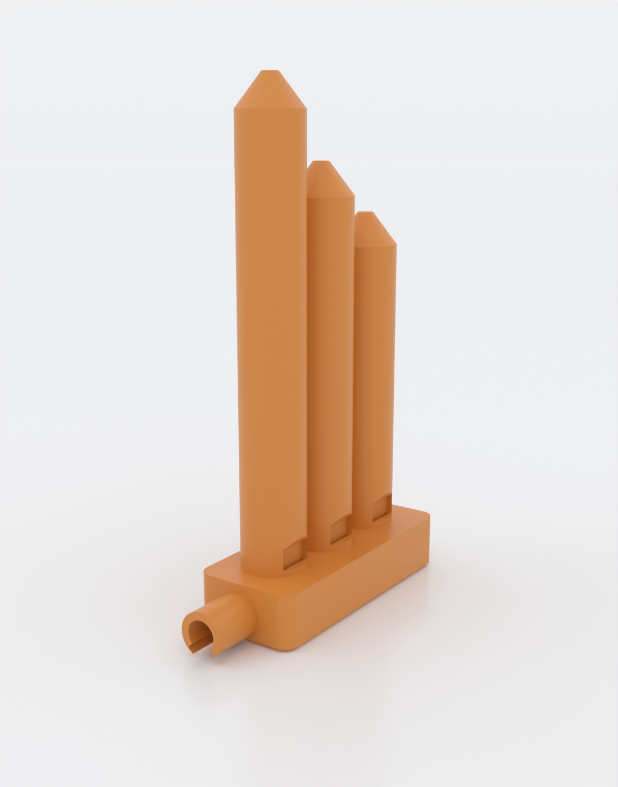
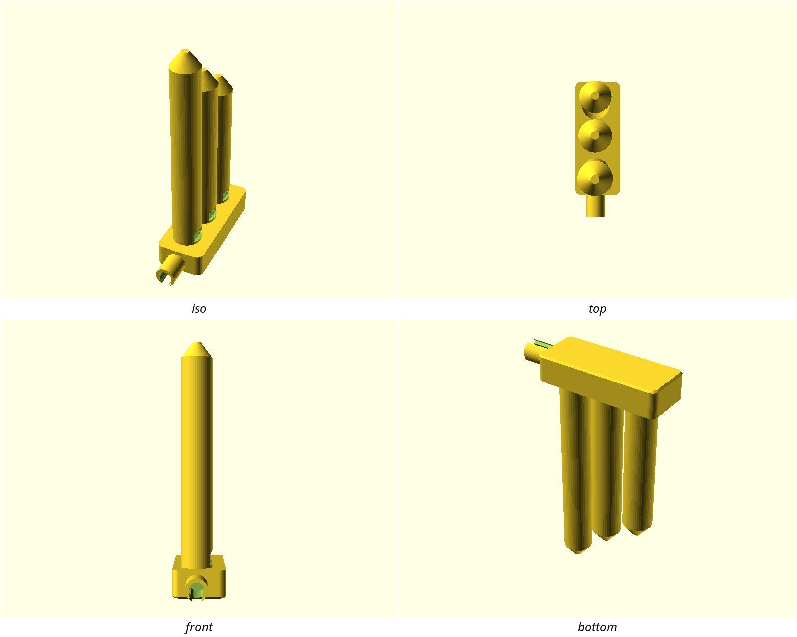
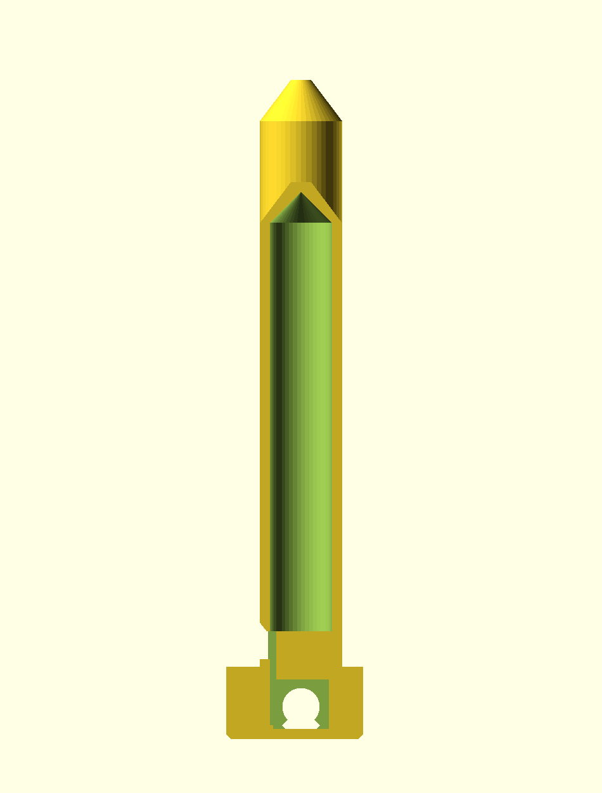

# aerochord

**One breath, a whole chord.** aerochord is a print-in-place wind instrument
with no equivalent in the historical record: a single mouthpiece feeds a shared
plenum that splits into several internal *fipples* (the flue-and-edge sound
maker of a recorder or tin whistle), each voicing its own closed pipe tuned to a
note of a chord. Blow once and every voice speaks together. It prints as **one
piece, standing up, with no supports** — the intricate internal air path only
works because it was solved to be printable. For anyone who wants an
instrument that is impossible to buy and faintly impossible to explain.



The three graduated pipes are the three voices of the default major triad — the
tallest is the lowest note. The windows (mouths) sit at the front base of each
pipe; the tube you blow into is at the bottom.



## How it works

A recorder makes sound with a *fipple*: your breath is squeezed into a thin flat
jet (the **flue**) and thrown across a **window** at a sharp edge (the
**labium**), which splits it and sets the air in the pipe oscillating.
aerochord puts **one fipple per voice** and feeds them all from a single
**plenum** (a shared air reservoir), so a single breath drives several pipes at
once. Each pipe's length is *solved* from the closed-pipe relation
`f = c / (4·L)` so its pitch is one note of the chosen chord.

A cutaway through one voice shows the whole path — mouthpiece → plenum → windway
→ flue → window → labium → the closed-pipe bore with its self-supporting
conical top:



…and the fipple itself close up — the thin windway, the flue exit, the open
window, and the beveled labium:


> **Honest note on sound.** The repo's gate proves this print is watertight,
> printable, and sliceable — it does **not** prove the pitch or that a given
> voice speaks. Those depend on fine fipple geometry and airflow that only a
> physical print confirms. The dimensions follow documented whistle/recorder
> practice, and the design ships a one-voice coupon and a `tune` knob precisely
> so you can calibrate on a short print. Treat the printed pitches as *nominal*
> and expect to tune. See `NOTES.md` for the full acoustic derivation and
> caveats.

## What you get

A single print-in-place object — no assembly, no supports, no fasteners.

- `aerochord` — the full instrument, default 3 voices (approx. 22 × 67 × 106 mm,
  ~4 h, ~26 g PLA)
- `aerochord-coupon` — **print this first**: one voice to dial in the fipple and
  pitch on a ~1 h print before committing to the full chord

## Print settings

- **Material:** PLA (or PETG). Any color; the sound doesn't care.
- **Layer height:** 0.2 mm. A 0.4 mm nozzle is assumed throughout; 0.2 mm also
  works and only sharpens the labium.
- **Nozzle:** 0.2 mm or 0.4 mm. The thin 1 mm flue is the make-or-break feature
  — a larger nozzle can't form it.
- **Infill:** 15–20 % is plenty; the acoustic volumes are the hollow bores, not
  infill.
- **Supports:** **none needed.** Everything is self-supporting by construction.
- **Orientation:** exactly as it renders — base flat on the bed, pipes up.
- **Brim:** **recommended.** The instrument is tall and slim; a 5 mm brim keeps
  it planted. The slicer's generic "stability" warning is expected and is what
  the brim answers.
- **Print the coupon first** (`aerochord-coupon.scad`) and tune before the full
  run — see `NOTES.md` → *Print this first*.

## Parameters

All parameters live at the top of `aerochord.scad`, grouped in Customizer
sections. The ones most worth touching:

| Parameter | Default | What it does |
|---|---|---|
| `chord_ratios` | `[1, 5/4, 3/2]` | The chord, as just-intonation ratios. `[1, 6/5, 3/2]` = minor; add `2` for a root+octave; more entries = more voices |
| `root_freq` | `1046.5` Hz (C6) | Pitch of the lowest voice. Lower = taller, floppier pipes; higher = shorter, sturdier |
| `tune` | `1.0` | Scales every pipe length together to correct measured pitch. `tune = target/measured` after a test print. >1 lowers pitch |
| `flue_h` | `1.0` mm | Windway air-gap — the critical FDM feature. Raise in 0.1 mm steps if a voice won't speak. Guarded ≥ 0.8 |
| `cutup` | `4.5` mm | Flue-to-labium distance; the fipple's tone control. Breathy → lower it; shrill → raise it |
| `bore_d` | `10` mm | Pipe bore diameter — louder/lower-impedance when wider |

Override on the command line, e.g. a warmer minor chord an octave down:

```bash
xvfb-run -a openscad -o build/aerochord.stl \
  -D 'chord_ratios=[1, 6/5, 3/2]' -D 'root_freq=523.25' \
  designs/aerochord/aerochord.scad
```

## Assembly & use

No assembly. Snip the brim, clear any stray strands from the windows and the
flue slots (a slip of paper or a 0.3 mm feeler through each window helps), and
blow steadily into the mouthpiece. All voices should sound at once. If one is
silent or airy, that's a fipple to tune — see `NOTES.md` → *Print this first*.
