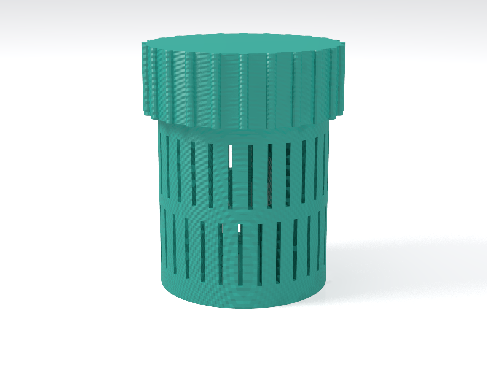
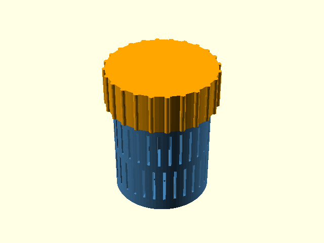
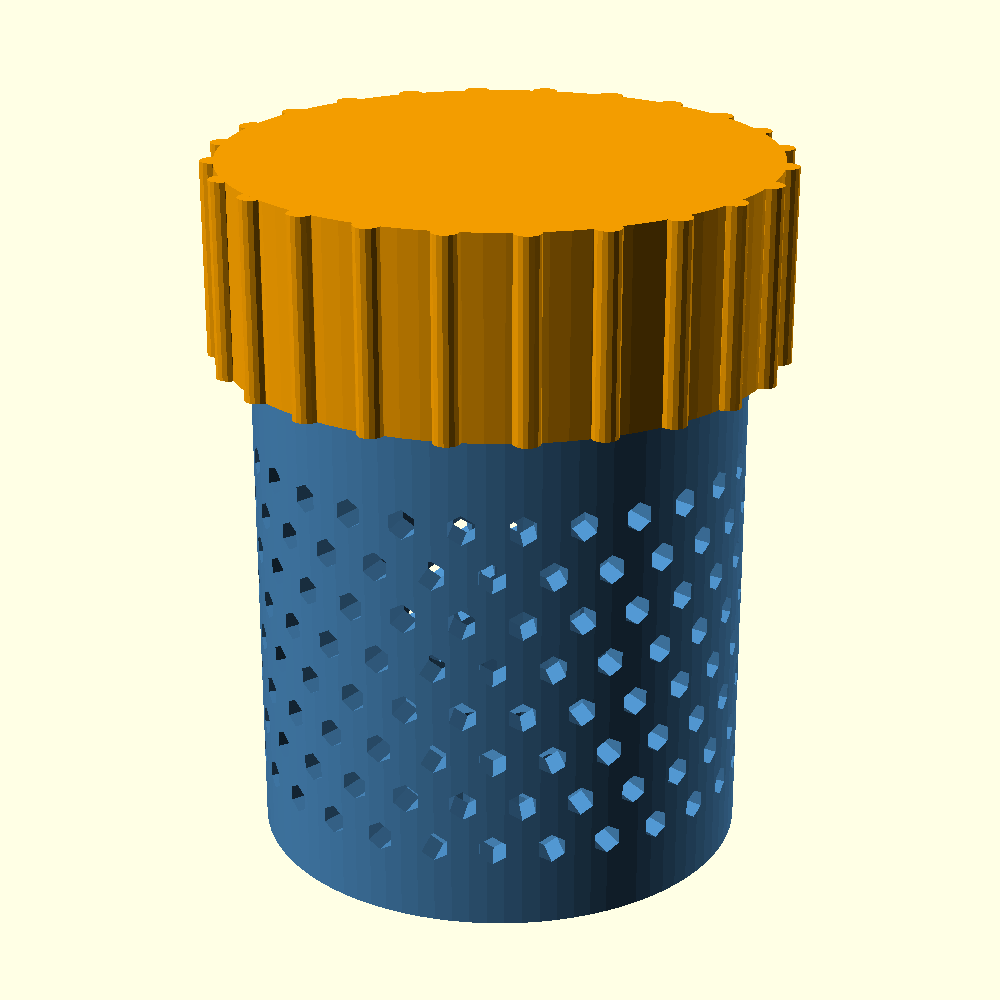

# Desiccant Capsule

Refillable two-part screw capsule for loose silica gel beads in filament
dry-boxes. The perforated body lets air and moisture reach the beads, and
the lid screws on with real trapezoidal threads and a ribbed grip edge —
easy to open even with dry-box gloves on. Both parts print support-free
on FDM, with vents sized for a standard 0.4 mm nozzle.

## What you get

One `.scad` file that generates both parts. With the default
`part = "print"`, both are laid out side by side on one plate, ready to
slice; `body`, `lid`, `assembly`, and `cutaway` are also available.

- **Body** — perforated cylinder with a threaded neck, ~30 mm outer
  diameter × ~40 mm tall. Vertical slot vents (0.8 mm wide, 2.4 mm webs)
  plus a perforated floor; every opening is sized to retain a worn 1 mm
  indicating-silica bead, and the render fails with a clear message if
  you widen the vents past that limit.
- **Lid** — screw-on cap with internal threads, a lead-in chamfer, and
  24 grip ribs (~35 mm across the ribs). Two-start, 4 mm-pitch threads
  mean it opens in about one turn.

Closed up, the capsule is ~35 mm across the ribs × ~43 mm tall — handy
when sizing a dry-box slot; the `.scad` echoes the exact values
(35.0 mm and 42.8 mm at the defaults) at render time.

| Closed assembly | Section through the thread zone |
|---|---|
|  |  |

## Print settings

- **Material:** PLA or PETG. If you regenerate the silica in a warm oven
  with the beads still inside the capsule, use PETG (or empty the beads
  out first).
- **Layer height:** 0.2 mm works well — the 45° thread flanks and
  vertical slot vents print cleanly at standard layer heights; finer
  layers just cost time.
- **Infill:** doesn't matter here — the part is nearly all walls, floor,
  and threads, so any default is fine.
- **Supports:** none needed, on either part. Thread flanks are 45°, the
  body's internal shoulder is a 45° cone, and each slot vent bridges
  only its own 0.8 mm width.
- **Orientation:** as generated. The body prints upright on its floor;
  `part = "lid"` (and the default `"print"` layout) already outputs the
  lid flipped — flat top on the bed, internal threads up a vertical
  bore.
- **Nozzle:** the default 0.8 mm slot vents are chosen to print crisply
  on a standard 0.4 mm nozzle; the optional hex vents tend to seal shut
  at sub-1 mm sizes, so keep them for coarser beads.

## Parameters

The ones you're most likely to touch:

| Parameter | Default | What it does |
|---|---|---|
| `part` | `"print"` | Geometry to generate: `body`, `lid`, `print` (both, sliceable), `assembly`, `cutaway` |
| `thread_tol` | 0.3 mm | Radial clearance on the female thread — the fit-tuning knob (see below) |
| `body_od` | 30 mm | Body outer diameter |
| `body_h` | 40 mm | Overall body height, including the threaded neck |
| `vent_style` | `"slot"` | `slot` (default) or `hex` vents on the side wall |
| `vent_w` | 0.8 mm | Max vent opening size; guarded against `bead_min` |
| `bead_min` | 1.0 mm | Smallest bead the capsule must retain (1.0 = indicating silica gel, 1–3 mm grade) |
| `floor_vents` | `true` | Perforate the floor as well |

All parameters are at the top of `desiccant-capsule.scad`, grouped in
Customizer sections; override on the command line with
`-D 'thread_tol=0.4'`.

## Assembly & use

Print both parts, fill the body with silica gel through the neck, and
screw the lid down until its rim seats on the body shoulder — that
shoulder is a positive stop, so you can't overtighten into the threads.
Drop the capsule into your dry-box and swap or regenerate the beads
whenever your indicating silica changes color.

**Dialing in the thread fit:** thread clearance is one number,
`thread_tol` (default 0.3 mm), and it applies equally at crests, roots,
and flanks. If the lid binds, increase it in steps of 0.1 and reprint
**the lid only** (`part = "lid"`); if the lid feels sloppy, decrease it
by 0.1. The body never needs reprinting to fix the fit.

Design rationale — the thread-clearance derivation, bead-containment
guards, and vent open-area accounting — lives in [NOTES.md](NOTES.md).
