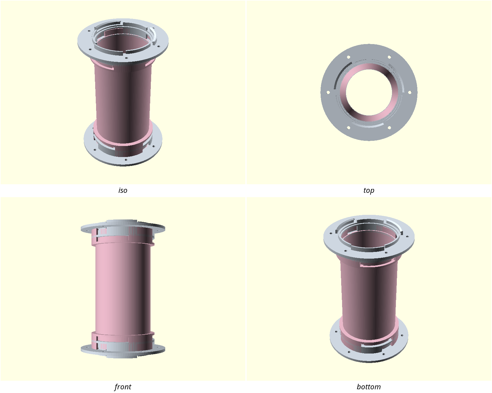

# nuggs — N.U.G.G.S.

**Nugget's Universal Genderless Gallery Standard.** Design request: #34.
Full research dossier with sources: [`docs/nuggs-research.md`](../../docs/nuggs-research.md).

## Previews

## Status — round 4; the one fit knob is now actually one knob, still not printed

> **Round 5 (2026-08-03) is a re-charter, not a geometry round** — see
> "Round 5 — the re-charter" below. It fixes two citation defects, re-scopes
> the welfare length rule from a system total to a per-run limit, and makes
> the design a *system* whose standard is the port. The gate table below is
> round 4's and still stands for the four parts as they were; any geometry
> or assert-message change landing alongside the re-charter re-measures it.

`./scripts/gate.sh --slice` **exits 0** — run over *all* designs, not just
nuggs, because round 4 touched `scripts/check.sh`. All four nuggs parts are
watertight single bodies with no CRITICAL findings:

| part | printcheck | filament | round 3 | note |
|---|---|---|---|---|
| straight | 84/100 | 149.5 g | 84 / 149.6 g | now carries the engraved rev + rule; costs 0.1 g and moves the overhang fraction not at all (3%) |
| bulkhead_in | **100/100** | **38.1 g** | 84 / 56.7 g | inward port removed (#56/3) — no warnings left at all, including the degenerate faces |
| bulkhead_out | 84/100 | 36.2 g | 84 / 36.2 g | rev engraved on the flange rim, no measurable cost |
| coupon | 84/100 | 90.4 g | 84 / 90.5 g | deliberately unmarked — a 25 mm stub is port zone end to end |

The remaining 84s are the CGAL degenerate-faces artifact and 3–5% overhang,
both pre-existing. `bulkhead_in` losing its degenerate faces along with its
port is a data point for B1b: the slivers live in `nuggs_port()`.

A green gate is **not** validation, but the joint is no longer taken on
faith: `nuggs-matetest.scad` now confirms two identical ports nest, twist
either way, and **retain** (below). Nothing has been physically printed, so
`port_tol` remains a guess. Open items are at the bottom.

## Goal

An 80 mm-bore tunnel **system** for an adult Syrian hamster, built around
one genderless quarter-turn port that every module carries at every end.
The kit that exists today is the Bin Bridge: two bulkheads and one straight
joining two enclosures through their walls, with nothing inside the cage.

Hero build — the **Bin Bridge**: bin wall → bulkhead → straight →
bulkhead → bin wall.

⚠️ **Framing changed 2026-08-03 (round 5, below).** Rounds 1–4 recorded the
goal as *"a short, straight, wide-bore tunnel… **not** a tube system"*, on
the grounds that the welfare length rule made a sprawling run
non-compliant. That premise was wrong twice over — the rule is not TVT's
and it is not a system-wide sum — so the "not a system" framing is struck
rather than defended. The original wording is preserved here because it is
what rounds 1–4 were designed against, and because PLOS One's verdict on
tube systems as a *category* has not gone anywhere: it is still the first
thing the product page says.

## Given / assumed measurements

- **Assumed, needs the owner's ruler:** `body_len_mm = 180` (Merck's upper
  head-and-body figure). This sets the entire enclosed-**run** budget (2 ×;
  see round 5). Measure the animal.
- **Assumed:** enclosure wall 1.5–20 mm (thin PP tote through plywood).
- **Unknown, and nobody publishes it:** Syrian shoulder width, hip width,
  and head width with both pouches loaded. The pelvis is the rigid
  non-compressible section. 80 mm is very probably generous — but that is
  not a derivation, and the bore floor is an assert precisely because of it.

## Key decisions

- **Bore 80 mm, hard floor 70 mm.** 70 is the Deutscher Tierschutzbund
  entrance minimum on the pouch-full criterion; 80 is the German
  tube-specific figure for a full-grown Syrian. `min_bore_mm` is asserted,
  never a tunable minimum.
- **Total enclosed length ≤ 2 × body length** (TVT Merkblatt 62) —
  ⚠️ **superseded in round 5, below, on both counts: the source is the
  Deutscher Tierschutzbund position paper, not TVT, and the limit is
  per-RUN, not a system total.** The v1 arithmetic is unchanged and passes
  under either rule; kept here as written because rounds 1–4's geometry was
  designed against it. Asserted
  across straight + both bulkhead throats. At defaults: 160 + 2×(25+10) =
  230 ≤ 360 ✓. The bed limit (240 mm incl. port projections) binds before
  the welfare limit does, so a single-straight run cannot breach it by
  accident. **Two straights chained would** (420 mm) — OpenSCAD cannot
  assert what a human assembles, so the rule is carried in the two places a
  human meets it: engraved on the outer wall of every straight
  (`ONE STRAIGHT PER RUN`, round 4) and called out in a block quote at the
  head of the README's assembly section. Both were *claimed* here from
  round 1 and neither existed until round 4 — see below.
- **Genderless coupling, and it is the whole thesis.** One tolerance knob,
  one coupon, zero coupler parts, and any module leaves the middle of a run
  in one twist — which is what the emergency-access requirement actually
  cashes out to.
- **How the genderless port works.** The coupling ring `[ro, r_out]` is
  split at `r_mid`. Each face carries the **outer** shell over `n_lug`
  sectors and the **inner** shell over the sectors between them. Two
  identical faces therefore nest: where one part presents outer shell, the
  mate presents inner shell, at a different radius. Self-complementarity is
  asserted as `lug_deg <= 360/n_lug/2`.
- **Locking** is a bayonet: each outer sector carries an inward rib, each
  inner sector a matching external groove (axial entry, then a `twist_deg`
  circumferential run). Both features exist on every part, so any face mates
  with any face.
- **A backing collar is structurally required.** The outer sectors sit at
  `r > r_mid` and touch no tube wall — without a full annular collar inside
  the tube body they are free-floating geometry. The collar doubles as the
  mate's axial stop.
- **Tube faces butt at z = 0; sectors run alongside the mate's tube.** This
  is what keeps the bore continuous — an earlier arrangement put the port
  projection *between* the faces and opened a 5.6 mm gap in the bore, which
  is a claw and pouch trap.
- **Corrected from the dossier: `lug_engage = 2.4 mm` is not usable.** At
  r = 44.4 that is 3.1° of arc, which cannot deliver the "60° twist to full
  overlap" the same document claims. Engagement is an *angle*, not a chord.
  Recorded here so the 2.4 mm figure is not reintroduced from the dossier.
- **The rib must be much narrower than the sector** (`rib_deg = 12` against
  `lug_deg = 40`). The entry slot has to admit the rib axially, so a
  full-width rib means a full-width slot and nothing left to twist under.
  This is the non-obvious constraint that made round 1's joint hold nothing.
- **The circumferential run is full sector width**, so the joint retains in
  either twist direction. Handedness is a thing to get wrong for no benefit.
- **`chamfer_ang = 50`, not 45.** printcheck's overhang test is a strict `>`
  against cos 45°, and OpenSCAD's inscribed polygons put a nominal 45° cone
  at 45.0086°. 50° costs nothing and removes the ambiguity.
- **`lug_deg` is a bed-adhesion parameter as much as a coupling one.** The
  part stands on the sector tips, so sector width sets first-layer area. Keep
  it as wide as the asserts allow, minus headroom for `twist_deg`.
- **`bite = 0.8` everywhere two solids meet.** A zero-volume "kiss" contact
  leaves CGAL counting the parts as separate bodies — this cost two debug
  rounds (see below).

## Print settings (intended, not yet validated)

- **Material:** natural/uncoloured PETG. Not PLA — PLA's Tg (57–70 °C)
  overlaps the dishwasher band, and a deformed tube is a *narrowed* tube, so
  the material failure mode is the animal-injury failure mode.
- **Orientation:** tube axis vertical.
- **Supports:** none intended; every downward face should be ≥ 50°.
- **Brim:** required, `outer_and_inner`. Not optional — see below.
- **Cleaning:** hand wash only, ≤ 50 °C. Never a dishwasher (the *dry* cycle
  is what exceeds even PETG's Tg).

## Print this first: the coupon

`nuggs-coupon.scad` is two 25 mm port stubs printed as a mated pair, from
the production modules. Tune `port_tol` in ±0.05 steps (asserted 0.10–0.60).
It doubles as the **bore gauge**: caliper it, and if the bore is under
79.0 mm your printer is shrinking and the straights will shrink too.

`port_tol = 0.30` is a starting guess, deliberately not inherited from
sushi-battleship's `clr_h`/`clr_v` — those are clearances between surfaces
made in *one* print at a fixed orientation. This joins two separately
printed ~97 mm parts and must additionally absorb per-part diameter error
and shrinkage: 0.3 % of 97 mm is 0.29 mm on its own, nearly the whole
budget. Expect the first coupon to be wrong.

## Debug log — things that cost a round

1. **13 free bodies, and printcheck called it PRINTABLE.** The first port
   rendered as 26 CGAL volumes. Two causes: (a) ribs spanning
   `[r_mid-rib_h, r_mid]` while the outer sectors start at
   `r_mid + port_tol/2` — a 0.15 mm gap, so every rib floated; (b) the
   lead-in taper was an annular cutter whose bottom plane sat exactly at the
   sector tips, slicing a 1.5 mm disc off all 12 sectors. Recut as a cone
   rising from *below* the tips. **The gate never flagged this**: multiple
   bodies is INFO, not CRITICAL, so a part that would arrive on the plate as
   13 loose pieces scored 76/100 and would have exited 0.
2. **`bulkhead_out` printed its port into the flange.** `nuggs_port()` puts
   its tube body on +z and its sectors on -z, so placing it unmirrored on top
   of the flange pointed every sector at the bed: 30 % overhang, CRITICAL,
   `gate.sh` exit 1. Mirrored and lifted by the collar height it reads 3 %.
   This is the one failure in the round the gate *did* catch on its own.
3. **The coupon was rendering the entire assembly.** The wrapper had its
   overrides *above* `include <nuggs.scad>`, so the entry file's own
   `part = "assembled"` won — OpenSCAD's include semantics are
   include-then-override, and `sushi-battleship-coupon.scad` shows the
   correct order. The "print this first" part was a 130 × 130 × 188 mm,
   223 g, 16-hour full assembly, and the gate happily gated it. Now 111 g.
   Still heavy for a fit coupon: at an 80 mm bore even two 25 mm stubs are
   ~98 cm³, nothing like the dossier's 30 g estimate.
4. Both body-count bugs were found by splitting the STL with trimesh and printing each
   body's volume, extents and centroid — the disconnected pieces were all
   exactly 1.5 mm tall at the tip radii, which named the culprit instantly.
   Worth doing on any multi-sector part before trusting the gate.

## Verified: the coupling works (round 2)

`nuggs-matetest.scad` renders the **intersection** of two identical
straights joined face to face — the mate is the same part mirrored and
clocked by `pitch/2`. Zero volume means they can occupy that position;
non-zero means they cannot. Seated, then again after a 2 mm axial pull:

Re-measured in round 4 after the `port_tol` fix changed every circumferential
clearance in the joint. Clockings are read off the harness's own echo, never
typed in:

| clocking | seated (gap 0) | pulled 2 mm | round 3 | reading |
|---|---|---|---|---|
| 60° (insertion) | 0 mm³ | **free** (empty mesh) | free | pushes together and comes apart — the entry path |
| 46° (twist −14°) | 0 mm³ | **47.7583 mm³** | 47.7583 | locked |
| 74° (twist +14°) | 0 mm³ | **47.7585 mm³** | 47.7585 | locked |

Retains in **both** twist directions, so there is no handedness to get
right at 11 pm with a hamster in the tube.

Retention is *identical* to round 3, which is the expected result rather than
a suspicious one: when the joint is locked the rib sits in the middle of the
circumferential run, and the fix widened that run by 0.088° at each **end**.
Nothing bears on the ends. What the fix changed is the flank clearance during
the twist, which is a fit, not a retention.

**Retention capacity.** The rib reaches `rib_h` into the mate's inner-shell
band, giving a radial engagement of 44.25 → 45.25 mm = 1.00 mm over a
12° arc, ×3 ribs = **28.1 mm² of bearing area**. At a conservative 10 MPa
that is ~281 N (29 kg); at PETG's ~30 MPa, ~844 N. The animal weighs under
2 N. Retention is not the limiting factor — `port_tol` and the rib's root
in a printed part are, which is what the coupon exists to find out.

Twist travel is ±(`lug_deg` − `rib_deg`) = ±18°, and `twist_deg = 14`
leaves 4° of margin before the rib runs off the end of the sector.

### The three round-1 defects, and what fixed each

1. **Ports did not nest (1645 mm³).** The `bite` fusing each inner sector
   to *our* tube also drove 0.8 mm into the **mate's** tube OD. Fixed by
   sweeping the inner sector as one L-shaped profile: bore-side face clears
   `ro + port_tol/2` over the projecting half, and only the anchoring half
   reaches inward to fuse. Splitting it into two arcs instead — the round-1
   attempt — left a coincident cylindrical surface and a non-watertight
   mesh, which is why every sector is now **one swept polygon, never a
   union of two arcs**.
2. **The bayonet assert encoded the wrong constraint.** `twist_deg +
   lug_deg <= pitch` allowed defaults that collide on any twist. The mate's
   *like-radius* sectors sit half a pitch away, so the real limit is
   **`pitch/2`**. Now asserted. Round 2 set `lug_deg = 30`, `twist_deg = 14`;
   round 3 widened `lug_deg` to 40 for bed adhesion, which the mate test
   confirmed leaves the joint unchanged.
3. **Nothing retained.** The rib was as wide as the sector, so the entry
   slot that admits it consumed the whole sector and left nothing to twist
   under; and the lead-in taper was a *solid subtracted cone*, which
   removed everything inside it — the ribs included. Fixed by making the
   rib a narrow tab (`rib_deg = 12`, asserted `rib_deg + twist_deg <=
   lug_deg`) entering through a matching narrow slot, with a **full-width**
   circumferential run at the seat so it retains either way round. The
   taper is gone; square tips are also the better bed-contact face.

## Bed contact — measured, and why widening the sectors fixed it (round 3)

The straight prints tube-axis-vertical (horizontal is 23% overhang), is
180 mm tall, and takes ~10.5 h. For all of that the only thing holding it
down is the first layer — and it does not stand on its tube wall at all.
Measured **0 mm2 at the tube radius**: the port sectors project `port_proj`
past the tube face, so the part stands on the sector tips.

| | round 2 | round 3 |
|---|---|---|
| first-layer contact | 396.0 mm2 | **527.7 mm2** |
| ratio to bbox footprint | 4.4% (printcheck warns) | **5.9% (clear)** |
| circumference anchored | 52% | **69%** |
| contact shape | 6 islands, ~2.8 mm wide | 6 wider islands |

**A brim does not solve this.** At `r_out = 48.4`, a 30 deg gap is 25.3 mm
of arc; a 5 mm brim reaches 5 mm from each island edge, so it never bridges.
A brim roughly triples the anchored area (396 -> ~1110 mm2 estimated) but
leaves six separate brimmed islands. It is a real mitigation and still
required — it is not the fix.

**What actually fixed it: `lug_deg` 30 -> 40.** The sectors were narrower
than the asserts allow. The ceiling is `pitch/2 - twist_deg` = 46, so there
were 16 free degrees sitting unused. Widening costs ~4 g and buys 33% more
first-layer area and 17 points of coverage.

**It does not touch the joint.** Verified, not assumed — the mate test reads
identically at `lug_deg` 30, 40 and 44: free at the insertion clocking,
47.8 mm3 of retention at both locked clockings. Retention is set by
`rib_deg`, which did not move.

40 rather than 44 (which would give 580.5 mm2 / 75%) because 44 leaves only
2 deg of headroom on `lug_deg + twist_deg <= pitch/2`. 40 leaves 6, so
`twist_deg` can still grow to 20 if the printed coupon says the twist is
too short. Bed adhesion is a probability; twist travel is a fit the coupon
has not yet measured, and the unmeasured one gets the margin.

**Still not solved:** the six islands are still islands. If a printed
straight lifts a corner, the next lever is a sacrificial first-layer tie
ring outboard of `r_out` (free space in the assembly, since the mate never
exceeds `r_out`) — deliberately not done yet, because a sacrificial part
that must be removed is an N6 chew-edge risk if a user forgets, and that
trade is not worth making before a real print says it is needed.

## Round 4 — issue #56: the knob that wasn't one, and three untrue claims

Five defects, all reproduced before being fixed. Ordered as the issue orders
them.

### 1. `port_tol` was millimetres and degrees in the same function

`bayonet_groove()` used `t = port_tol` correctly as millimetres in the z and
radial terms, and then fed the same number straight into `rotate([0,0,a0-t])`
and into the sector widths `rib_deg + 2*t` / `lug_deg + 2*t`, where OpenSCAD
read it as **degrees**.

Rib and groove flanks are radial planes, so a fixed angle is a gap that grows
with radius. Measured from the echo, at the default 80 mm bore:

| | circumferential clearance per side |
|---|---|
| what the docs promise | 0.300 mm |
| what the geometry delivered, r = 44.25 (rib tip) | **0.2317 mm — 77 %** |
| what the geometry delivered, r = 45.25 (inner-sector face) | 0.2369 mm |
| at the asserted minimum `port_tol = 0.10` | 0.0772 mm — under one extrusion |

And it was bore-dependent, which is the part that really breaks the standard:
the same knob bought a different fit on a different bore, so a coupon tuned on
one bore mis-tunes another.

**Fixed** by deriving the angle from the radius — `tol_deg(r) = port_tol/r *
180/PI` — and sizing at `rib_in`, the tightest radius at which a rib flank
faces a groove flank, so the realised clearance is ≥ `port_tol` across the
whole engagement band rather than only on average. An explicit `port_tol_deg`
parameter was rejected: it would have made the "one knob" claim false by
construction, which is the thing being fixed.

Measured after, straight off the model's own echo:

| bore_d | port_tol | realised, tight end (r = rib_in) | loose end (r = i_out) |
|---|---|---|---|
| 70 | 0.10 / 0.30 / 0.60 | 0.100 / 0.300 / 0.600 | 0.1025 / 0.3076 / 0.6153 |
| 80 | 0.10 / 0.30 / 0.60 | 0.100 / 0.300 / 0.600 | 0.1023 / 0.3068 / 0.6136 |
| 120 | 0.10 / 0.30 | 0.100 / 0.300 | 0.1016 / 0.3047 |

The knob now means millimetres at every bore. The residual 1.5–2.5 % spread
across the band is geometric — two radial planes cannot be parallel — and is
bounded by an assert.

**Regression pin.** Two asserts plus an echo, and they are deliberately not
tautologies: `circ_clr` is read back *out of* `slot_deg`, the angular width
the geometry actually uses, and converted to millimetres at `rib_in`. Writing
`rib_deg + 2*port_tol` again fails the render at 0.2317 ≠ 0.300 instead of
quietly tightening the joint by 23 %. The second assert catches the angle
being derived at the wrong radius.

**The joint was re-verified, not assumed** — see the mate-test table above.
Retention is unchanged at 47.758 mm³ because when locked the rib sits mid-run,
0.088° from neither flank; the widening only trims the ends of the
circumferential run, which nothing bears on.

### 2. `check.sh` reported `ok` on a design whose welfare asserts were firing

`openscad --export-format echo` writes `ERROR: Assertion ... failed` into the
export file and **exits 0**. `scripts/check.sh` read the file back (fixed in
#43) but only grepped for `WARNING` and its `FATAL_WARN` set, so `ERROR` was
never matched. `bore_d = 50` — 20 mm under the welfare floor — printed
`ok    designs/nuggs/nuggs.scad` and exited 0.

`gate.sh` always caught it (a real render surfaces the assert and exits 1), so
CI was never blind. The *fast local check a developer actually runs* was.
Since PM.md makes asserts the enforcement mechanism for the non-negotiables,
an unenforced assert is the whole safety net.

**Fixed** in `scripts/check.sh`: `FATAL_ERR="ERROR|Assertion.*failed"`, tested
before the WARNING branch. Verified with the issue's own repro — `bore_d = 50`
now gives `FAIL designs/nuggs/nuggs.scad (ERROR/failed assert — OpenSCAD still
exited 0)` and exit 1, on both `nuggs.scad` and `nuggs-coupon.scad`; `bore_d`
restored to 80 and the file diffed back to byte-identical afterwards.

This is infra, so it re-gates every design: `gate.sh --slice` was run with no
arguments over all four designs, not just nuggs.

### 3. The inward port on `bulkhead_in` — investigated, then removed

Measured on the round-3 part:

- **14 150 mm³** (18.0 g of solid PETG) of coupling port projecting to
  **z = −13**, i.e. 13 mm *into the enclosure*, at bedding height, reaching
  r = 48.4 mm. Six square sector tips, six groove mouths, three proud rib tabs.
- and, not in the issue and worse: **2 869 mm³ in six lumps standing 6.0 mm
  proud of the flange's own clamping face**, on the wall side. The inner
  flange could not sit flat against the enclosure wall at all. It would have
  stood off on six points and rocked, and torquing 6 × M4 against that either
  bows the flange or cracks a thin PP bin wall.

**Nothing mates with it.** In the documented Bin Bridge the straight couples
to `bulkhead_out`, on the far side of the wall. `assembled()` never
instantiates `bulkhead_in` at all. The README has described this part as
"inner flange + full-bore spigot through an 89 mm wall hole" since round 1 —
the product page never knew the port was there.

**And nothing ever could mate with it.** The only thing it could serve is an
in-enclosure module, and PM.md lists "any in-cage configuration" under **Out
of scope → Never**, with a sourced reason (Hauzenberger et al. 2006 — a tunnel
that eats floor or substrate is a net welfare loss). So the "it's for future
modules" branch of the issue's question is closed by the charter, not by
opinion.

That makes it vestigial geometry that failed **N6** in the one place the
animal actually lives, and broke the clamp in the one place it has a job.
**Removed.** `bulkhead_in` is now flange + full-bore spigot, spanning
z = 0..29 instead of −13..29, 45 340 mm³ instead of 62 679, watertight, one
body. The enclosure-side bore mouth keeps an edge break (`bore_lead`), which
only ever *widens* the bore, so N1 is untouched.

Two side effects worth knowing:

- Bed contact goes from six sector tips to the whole flange annulus —
  ~8 100 mm² of first layer instead of standing on the port.
- N6 is now satisfied by the reference part, so it does **not** need
  restating. If a later round ever wants an in-enclosure module, that is a
  charter change first (the Never line), and N6 second.

This is a real geometry change to a printable part and was re-verified end to
end: render, printcheck, test-slice, and the full mate test.

### 4. `NUGGS_REV` was embossed on nothing

Declared at line 12, referenced nowhere, and the file contained no `text()` at
all — while NOTES.md claimed the length limit "is embossed on the part" as the
mitigation for the only composition hazard the design admits.

**Fixed by engraving it**, under two rules:

- **Engraved, never proud.** A raised character is exactly the
  chew-initiation edge N6 forbids. Recessed `mark_d = 0.6` mm into a 2.4 mm
  wall leaves 1.8 mm — still ≥ 3 perimeters, and asserted as such.
- **Only on a face that looks at the room.** The straight's outer wall runs
  between the two enclosures; `bulkhead_out`'s flange rim is outside the wall.
  Neither is reachable from the bore or from inside the cage. **`bulkhead_in`
  is deliberately left unmarked** — every face it has is either inside the
  enclosure with the animal or buried in the wall hole. `NUGGS_REV`'s comment
  now says that rather than claiming "every module".

The straight carries two lines, `NUGGS R1` and `ONE STRAIGHT PER RUN`;
`bulkhead_out`'s 4 mm rim carries the revision only. Text is cut **one
character at a time, each on its own tangent plane** — the rule spans 91.2 mm
of arc (123.2° at r = 42.4) and one flat cut across that has a sagitta of
22.2 mm, nine times the wall. Per character it is 0.068 mm.

`mark_straight()` is a no-op when the tube has no clear wall between its two
port zones, which is why the 25 mm coupon stub is unmarked and stays a fit
coupon rather than becoming a text test.

### 5. The README didn't contain the sentence this file said it did

It does now, as a block quote at the head of "Assembly & use" — with the
arithmetic (230 mm for one straight, 420 mm for two, 360 mm budget) and the
reason it is dangerous, which is that two straights *will* mate and feel
right, because every NUGGS face mates with every other. It is also in the
defect table at the top and in the new "Markings" section.

This was the fifth stale-claim defect in this design and the fourth caught by
review rather than by a check. The mate-test harness was fixed by *deriving*
its numbers; prose can't do that. `port_tol` now has a regression pin for the
same reason — the argument that keeps winning here is "make the check read the
value back out of the geometry", and it should be applied to the next claim
too, not just the last one.

## Round 5 — the re-charter: two citation defects, and a rule that was mis-scoped

This round changed no geometry of its own. It changed what the geometry is
*allowed to be*, which is why it is written down at this length.

The owner's ruling that opened it: **N.U.G.G.S. is a tube system with one
genderless interlock standard shared by every module; the welfare sources
were over-applied; enclosed tubes are permitted; the total-system length
ban becomes a per-run limit with a defined thing that resets it; the 70 mm
bore floor stays a hard assert and is not reopened.**

### 5.1 The two citation defects

**Defect A — the 2× body-length rule is almost certainly not TVT's.**
Rounds 1–4 attributed it to *TVT Merkblatt 62* in this file, in PM.md's N2,
in the README, in the dossier and in the OpenSCAD assert message. A
re-verification sweep ran five searches aimed squarely at a length rule in
MB 62 and **never once got a length limit attributed to TVT**. What MB 62
consistently returns is the qualitative objection set we already had:
cannot be cleaned, cannot be sufficiently ventilated, transparent tube
leaves no retreat. The 2× sentence came back repeatedly — including from a
domain-restricted search — attributed to the **Deutscher Tierschutzbund**
position paper *Tierschutzwidriges Zubehör*, and there as one limb of a
**conjunctive** product-acceptability test: tubes are acceptable only if
they are at most twice body length **and** ensure adequate ventilation
(a third limb: **and** ship with instructions against misuse).

Two consequences beyond the name. It is a *retail* position paper about
what shops may sell, not a husbandry guideline — respecting it is
reasonable, calling it "the single hardest quantitative limit available"
was not. And quoting the length limb on its own quotes the sentence out of
context; the ventilation limb is the one this design answers by
construction.

**Defect B — the Hauzenberger author list is wrong.** The dossier cited
*Hauzenberger, Mueller & Wechsler 2006*. It is **Hauzenberger,
Gebhardt-Henrich & Steiger (2006)**, *Appl. Anim. Behav. Sci.* 100:280–294.
Journal, volume and pages check out; the substance survives (45 singly
housed males at 80/40/10 cm; recommendation "at least 40 cm"; the 80 cm
group carried more body fat). Corrected in the dossier.

This is the **sixth** stale-claim defect in this design and the first that
was a *citation* rather than a dimension — which is worth noting against
B1c, because the argument that keeps winning here ("make the check read the
value back out of the geometry") has no analogue for a source. A citation
cannot be derived from the mesh. It can only be read, and nobody has read
this one.

### 5.2 The rule, stated precisely enough for an assert message to agree with it

- A **RUN** is the maximal chain of **continuously enclosed bore** between
  two breaks.
- A **BREAK** is exactly one of:
  1. an **open module** — a bore carrying a longitudinal window of **≥ 180°**
     (wall tops at or below the springline, so the opening is the widest
     part of the void and the animal lifts straight out);
  2. a **port discharging into a ventilated enclosure** (an open end);
  3. a **turnaround node** — clear internal width **≥ `body_len_mm`**
     **and itself open to ventilated space**. The ventilation clause was
     missing until PR #78 review: as first written a node broke a run on
     width alone, while the same section required every run to be open at
     both ends into ventilated space. Width answers *can he turn around*;
     it says nothing about *can the air move*, and the reading that lets a
     sealed chamber break a run is the one that permits an unventilated
     dead volume mid-system.
- **Limit: `2 × body_len_mm` per run** (360 mm at the default). If a run is
  **not** hand-releasable in one action, the limit is
  **`min(2 × body_len_mm, 300 mm)`** — not "drops to 300", which is only a drop
  above `body_len_mm = 150`. Below that the 2× bound is already the stricter of
  the two and the 300 mm hand-reach figure never binds. The assert message
  states it the same way; both were corrected together after the "drops to"
  phrasing was found to contradict itself on any small animal (PR #78 review).
- **NOT breaks, and this is the part that must be prominent in every
  message that mentions the rule:** a **bend** is not a break; a
  **junction at bore diameter** is not a break; a **coupling** is not a
  break; a **top hatch** resets **retrieval**, not **reversing**.

**The derivation is the point.** Because the animal cannot turn around in
an 80 mm bore — a hairpin needs roughly two body widths plus bend
allowance, ~110 mm at a ~45 mm body width — he exits by whichever end is
nearer, so worst-case unassisted reverse travel is **half the run**. A run
≤ 360 mm bounds it at 180 mm = one body length. That turns an inherited
magic number into a derived one, and **it is engineering judgement**: no
literature measures how far a hamster will reverse. Any assert message,
README line or charter row that states the reversing argument must say so
in the same breath.

**Assert messages must therefore name DTSchB, never TVT**, must say the
limit is one limb of a conjunctive test, must state that a bend is not a
break, and must label the reversing derivation as judgement. Anything that
says "TVT Merkblatt 62" next to this number is the defect this round
exists to remove.

### 5.3 Why this is a re-scoping and not a loosening

The German is plural — *the tubes are acceptable if **they** are at most
twice body length* — which reads per tube. The 238 mm "total enclosed"
figure rounds 1–4 asserted was **our own aggregation** of straight plus two
bulkhead throats; nothing in the sentence demanded that sum.

And the v1 Bin Bridge **passes under both rules** (238 ≤ 360). This was not
a change made to rescue a failing design. What it changes is the future:
under a per-run rule a branched or looping layout is compliant iff every
leg between breaks is short and every branch point claiming to reset the
count is a real node — which is also the wild-burrow topology (short
galleries punctuated by 10–20 cm chambers, Gattermann 2001).

### 5.4 Honesty, kept verbatim

> The per-tube reading rests on plural German in a search summary of a PDF
> nobody in this session could open (the gateway 403s tierschutz-tvt.de,
> tierschutzbund.de, PLOS, PMC, ScienceDirect, doi.org — WebFetch goes
> through the same proxy and fails identically). It is the hinge of the
> whole relaxation and it must be confirmed before this reaches a product
> page. The 180 deg open threshold, the 110 mm hairpin figure, the 150 mm
> hand-reach behind the 300 mm non-releasable carve-out, and the +/-40 deg
> walk band are all my judgement with no source at all — and the 300 mm
> figure's coincidence with the 25-30 cm circulating on German care sites
> is a cross-check, not authority. The 70 mm bore floor stays a hard
> assert.

Confidence ladder, in full, in `docs/nuggs-research.md` §11.6. The short
version: **HIGH** — the TVT attribution is probably wrong, the Hauzenberger
author list is definitely wrong, an 80 mm bore is a one-way bore.
**MODERATE** — the rule is DTSchB's and is conjunctive with ventilation.
**LOW** — that it is per-tube rather than per-system, *and this is the hinge
of the whole relaxation*. **NONE** — how far a hamster will reverse, the
110 mm folded-turn floor, the 150 mm hand-reach figure, the 300 mm
non-releasable carve-out, the 180° open threshold.

### 5.5 The two facts that cut both ways

Recorded because the product page will be quoted against both, and being
first to name them is cheaper than being corrected:

- **Stricter:** German pet-care content sites circulate "tubes should not
  be longer than 25–30 cm", usually paired with "≥ 6 cm diameter for a
  dwarf, ≥ 8 cm for a golden hamster". Neither TVT nor DTSchB, weak
  provenance, **not adopted** — but shorter than our 360 mm, not longer.
- **More permissive:** wild Syrian burrows have **40–50 mm** tunnels and
  galleries averaging **200 cm**, reaching **900 cm** (Gattermann 2001).
  A wild animal routinely works two metres of tunnel at half our bore. That
  is the strongest evidence the 2× figure is **not a biological tolerance**
  — it is a product-safety criterion about enclosed plastic that cannot be
  ventilated, cleaned or reached into. It is **not** a length licence: soil
  is grippable on all sides, self-ventilating, dug to fit that individual,
  and escapable by digging. An animal that jams in soil can excavate; one
  that jams in PETG cannot.

### 5.6 What did NOT change

- **`min_bore_mm = 70` stays a hard assert.** Reviewed against the 40–50 mm
  wild-tunnel figure and left alone. The failure mode is silent (grit in a
  full pouch → mucosal laceration → impaction → abscess, no visible symptom
  until surgery), so it cannot be a user judgement. Two qualifications are
  now recorded rather than suppressed: the DTSchB 7 cm figure is an
  *entrance-opening* minimum for furnishing objects generally, applied here
  to a bore; and it too is a search summary, so the quotation marks the
  dossier put around it were never earned.
- **N3's substance.** No dead ends, no dead air. What changed is how it is
  satisfied — by topology (every terminus is a node or an enclosure) rather
  than by banning branches.
- **N4, N6, N7, N8.** Untouched.
- **The nuggs-yard rebuild.** Deliberately not in this round. Its gendered
  lap-skirt joint is superseded by the single standard, and its open
  modules need rebuilding onto the port with a round arc floor — real
  geometry with its own gate run, and folding it in would make the charter
  change unreviewable. Banners added to that design's README and NOTES so
  nobody assumes the two kits interoperate today.

### 5.7 Why an open module's floor is the bore arc, not a flat trough

Recorded here because it is the one *geometric* consequence of the ruling,
and because it is the mistake a trough-shaped design makes naturally.
Against a round mate at `bore_d = 80` (ri = 40), a flat floor tangent to
the bore invert leaves the round module's material standing proud by:

| lateral offset from centreline | step |
|---|---|
| 10 mm | 1.27 mm |
| 20 mm | 5.36 mm |
| 22.5 mm (half a 45 mm body width) | 6.93 mm |
| 25.71 mm (**walk-band edge**, ±40°) | **9.36 mm** |
| 30 mm | 13.52 mm |

The bolded row is the one the guard actually enforces: `nuggs_window()`
refuses a window that eats the ±40° walk band, so 25.71 mm is the lateral
limit that matters, not 22.5. An earlier revision labelled the 22.5 mm row
"paw-span edge" and quoted its 6.93 mm as the step — understating it by
2.43 mm and describing it as facing the other way (PR #78 review).

That is a full-height vertical rim across the transition plane — a
toe-stub, which is exactly N6. A chord floor at half-width 25 mm goes the
other way and gives an 8.78 mm centreline pit, which also collects bedding
and urine. Only the **arc** floor gives a 0.000 mm step at every lateral
position, because both modules' bores are the same cylinder. There is no
third option, and no blend fixes it in less than a ~21 mm ramp at 1:3.

The price, accepted: the port forces bore-axis-**vertical** printing, which
caps a module at **45° of axis change** (a bore's inner normals lie
perpendicular to the local axis, so max |n_z| = sin(tilt), and sin 45° is
exactly printcheck's threshold). A 90° turn is two modules. That is a real
cost and it is paid deliberately.

## Round 6 — extraction verified, and a proof that was worth nothing

### 6.1 The two-way boolean difference is VACUOUS on this design

Both the library and the migration were signed off partly on "8/8 two-way
boolean differences empty — no file written, exit 0". That proof is worthless
here, and anyone reaching for it again on a NUGGS part should stop.

Importing a nuggs mesh into CGAL's Nef kernel throws an assertion violation
(`SNC_FM_decorator.h:418`), thrown by the port's known coplanar / zero-area
facets — the same degenerate shells tracked as B1b. OpenSCAD catches it, prints
`Current top level object is empty`, writes no file, and **exits 0**. So the
difference reports EMPTY for every pair involving `straight`, `bulkhead_out` or
`coupon` whether or not the two meshes differ. It is a check that cannot fail,
which is the same class of defect as a guard that cannot fire — and this repo
built `guards.conf` precisely because that class is invisible.

**What actually proves it**, and what replaced it: canonical triangle-set
equality at `mark_h = 0`. Rendered both ways, `straight` gives 4924 facets and
volume 126962.093155 mm³ from the pre-extraction source and 126962.093155 mm³
through the library — identical hash, not merely equal volume. `bulkhead_in`
and `coupon` likewise. That is a stronger statement than any boolean difference
and it does not route through the kernel that crashes.

### 6.2 So the extraction IS mesh-neutral, and the shipped delta is the engraving

The extraction changes nothing. The whole of the shipped-part delta is the
engraved text, which changed because the rule it carries changed:

| Part | Volume delta | Where |
|---|---|---|
| `straight` | −67.9 mm³ (−0.05%) | (37, 0, 79) mm — outer tube wall at mid-length |
| `bulkhead_out` | −5.9 mm³ (−0.01%) | (64, ±, 2) mm — flange rim |
| `bulkhead_in` | 0.00% | carries no mark, deliberately |

Confirmed three independent ways: the `mark_h = 0` equality above, canonical
hashing, and CI's own argus-diff, which localised every changed region to the
mark positions at ~0.67 mm max deviation — i.e. the engraving depth. Slice mass
moved 149.55 → 149.48 g on the straight, which is the same fact in grams.

The old mark read `NUGGS R1` / `ONE STRAIGHT PER RUN`. Under a per-run rule that
sentence is no longer the constraint, so the part now carries `NUGGS PORT R1`,
`MAX RUN 360MM` and `COUPLINGS DONT RESET` — both rule lines derived from
`body_len_mm`, so they cannot drift from the assert.

### 6.3 A guard written against the wrong limb

`NUGGS RIB OD` and `NUGGS COLLAR OD` bounded their overlap by `lug_r * split`.
The budget is the OUTER band, `r_out - r_mid = lug_r * (1 - split)`. At the
default `split = 0.5` the two expressions are the same number, so every guard
case in the manifest passed either way and nothing in the repo could see it. At
`split = 0.75` the outer band is 1.5 mm rather than 4.5, and a rib with
`bite = 2.0` stood proud of `r_out` while the guard waved it through — with its
own message correctly reporting the offending radius. Fixed, and pinned by two
new manifest cases at an asymmetric split. Raised by Qodo on PR #78.

Worth noting how it survived: `web = lug_r * split` a few lines above is
correct, because the web genuinely is in the inner band. Two adjacent
expressions, same shape, different limb — and only one of them wrong.

### 6.4 Doc claims that had drifted from the model

All found by the verification pass or by review bots, all the same failure this
file has now recorded six times: prose asserting something the model does not do.

- README stated the old engraved string in four places after the model changed it.
- The Bin Bridge run appeared as 238 mm in the docs and 230 mm in the model. 230
  is what both the pre- and post-migration source compute; 238 traced back to a
  single arithmetic slip in `docs/nuggs-research.md` §9, which wrote `port_len`
  (a name that does not exist) where `port_proj` belongs. Docs were aligned to
  the model at 230.
  **Superseded within the same round: the true figure is 246 mm.** Aligning the
  docs to the model was the right move and the wrong direction — the *model* was
  also wrong, omitting all four bulkhead flange plates (§6.5). So this entry
  records a fix that had to be redone two commits later, which is the useful
  lesson in it: "make the docs match the model" is only safe once the model has
  been checked against the geometry, and here it had not been.
- `NUGGS_REV` was renamed `NUGGS_PORT_REV`; the research dossier's spec tables
  still used the old name and described the mark as *embossed*, which is the
  chew-initiation edge N6 forbids. It is engraved. Dated NOTES and decision-log
  entries keep the old name deliberately — they were true when written.
- The run-length assert offered 300 mm as a "drop" for a non-releasable run.
  Below `body_len_mm = 150` that is a rise, so the message contradicted itself
  on any small animal. Now stated as `min(2 x body_len, 300)`.

### 6.5 Still open

- **Nightly/manifold is unverified locally** — `openscad-nightly` is not in this
  container, so every local number here is 2021.01/CGAL. It matters more than
  usual: the mate cases judge on "the kernel agrees an exact fit exports zero
  facets", and the four zero-area triangles per port are exactly what a
  different kernel is most likely to tessellate differently. CI runs it and is
  green, which is the only evidence there is.
- **`bulkhead_in`'s printcheck score is export-format dependent** — 100/100 as
  ASCII (what `gate.sh` writes), 92/100 as binary, where printcheck finds 16
  zero-area triangles. Identical geometry, not a regression, same root cause as
  B1b. Anyone comparing a local binary export against the gate's number will
  think the part regressed.
- **B1b itself is now load-bearing**, not cosmetic. Those degenerate facets are
  what crash the Nef import in 6.1, so they no longer merely make diffs noisy —
  they disable a whole class of verification.

## Open items — next round

- **Bed contact is improved but not proven.** The warning is cleared and
  coverage is up to 69%, but it is still six islands and no one has printed
  it. A brim remains mandatory in the README. See the round-3 section above
  for the next lever if a real print lifts.
- **Nothing has been printed.** `port_tol = 0.30` is still a guess, and the
  coupon is what settles it. Geometry says the joint retains; only a printed
  pair says it does so at a torque a human wants to apply.
- **Degenerate faces — traced, not fixed, and the earlier note here was
  wrong.** They are NOT absent under manifold; they manifest differently.
  Under CGAL 2021.01 the straight is one watertight component with 4-6
  zero-area triangles. Under the manifold backend CI uses, argus-diff sees
  **13 bodies — twelve of them 0.0 mm3**, i.e. the same slivers resolved as
  detached zero-volume shells. Zero material either way, so a slicer ignores
  them, but it is sloppy geometry and argus flags it on every diff.

  Both live at exactly two radii: `r = ro` (42.40) and `r = o_in` (45.55) —
  places where one solid's boundary surface passes exactly through another
  solid's face. The inner sector's anchoring half crosses the tube's outer
  cylinder at `ro`; something crosses the outer sector's inner face at
  `o_in`.

  **They predate the round-3 widening**: `lug_deg = 30` produces 6 and
  `lug_deg = 40` produces 4, at identical radii. Widening slightly reduced
  them. Do not attribute them to that change.

  Tried and rejected: extending the rib from `o_in + bite` out to `r_out`,
  on the theory that the rib crossing the sector's inner face caused it.
  No change — still 4 at the same radii. Reverted, since it altered geometry
  without fixing anything and would have invalidated the mate-test result.

  Not chased further because it is pre-existing, zero-volume, and does not
  advance a ranked backlog item. `openscad-nightly` is not installed in this
  environment, so CI's manifold mesh cannot be reproduced locally — that is
  the first thing to fix if anyone picks this up.

  **Round 4 narrowed the search for free.** Removing `nuggs_port()` from
  `bulkhead_in` took that part from 84/100 *with* degenerate faces to
  **100/100 with none**. The slivers are inside `nuggs_port()`, not in the
  tube, the flange or the bore cut. Both suspect radii (`ro`, `o_in`) are
  port radii, which agrees.
- **`port_tol` has never been printed, and round 4 changed what it means.**
  The knob is 23% looser circumferentially than the geometry that was
  reasoned about in rounds 1–3 (0.300 mm/side realised, where 0.2317 was
  realised before). Nobody has felt either. If the first printed coupon is
  loose, that is the number to look at first — and the fix is now a real
  ±0.05 mm step in every direction at once, which it was not before.
- Bulkhead spigot/counterbore fit is drawn but not dimensioned against a
  real wall-thickness range. Round 4 removed a hard blocker on ever
  measuring it: the inner flange could not sit flat against the wall at all
  while the port's sectors stood 6 mm proud of its clamping face.
- **`assembled()` is not the Bin Bridge.** It renders bulkhead_out →
  straight → bulkhead_out, so `bulkhead_in` — the part round 4 changed most —
  appears in no review preview at all, and the wall crossing the design
  exists to make is not shown. Noticed while investigating #56/3; not fixed,
  because preview cameras are frozen once a reviewer has seen them and this
  wants a new shot rather than a reframed one.
- No `previews/cameras.conf`, no `shots.conf`, no product shot yet.
- The mate test is not gated. `ci.parts` gates parts; nothing in this repo
  gates a *fit*, so a future change could silently un-fix the coupling and
  CI would stay green. Running `nuggs-matetest.scad` in the gate needs a
  convention that does not exist yet.
- **Nobody has read the DTSchB position paper, and it is now load-bearing.**
  Round 5 rests N2's per-run scope on plural German in a search summary
  (research §11.6, LOW confidence). This is the single highest-value thing
  anyone with an unrestricted network can do for this design, and it takes
  minutes: open *Tierschutzwidriges Zubehör* and read the tube sentence. If
  it is per-system, N2 reverts to a total and the branch/loop scope closes
  again. While reading, also settle TVT MB 62 (does it publish any length
  number at all?), the DTSchB 7 cm entrance minimum, the PLOS One tube
  verdict's **basis**, and the 20 mm loaded-pouch width.
- **The confidence ladder is now a maintained artifact.** `docs/nuggs-research.md`
  §11.6 grades every welfare figure HIGH/MODERATE/LOW/NONE. Anything added
  to this design that quotes a welfare number gets a row there, or it is a
  number with no provenance in a design whose whole argument is provenance.
