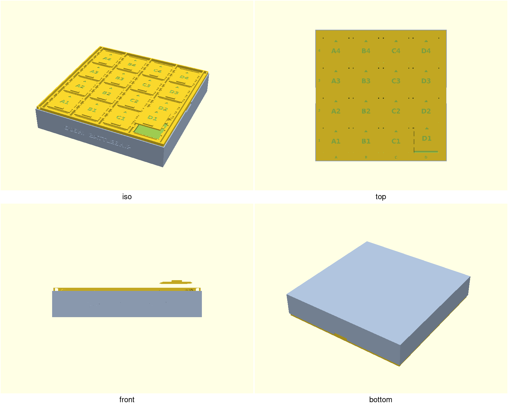
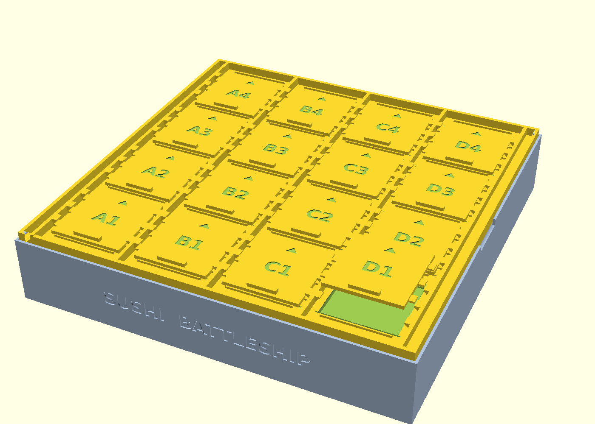
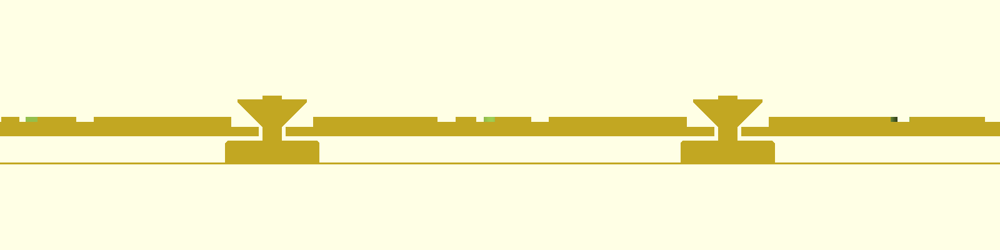
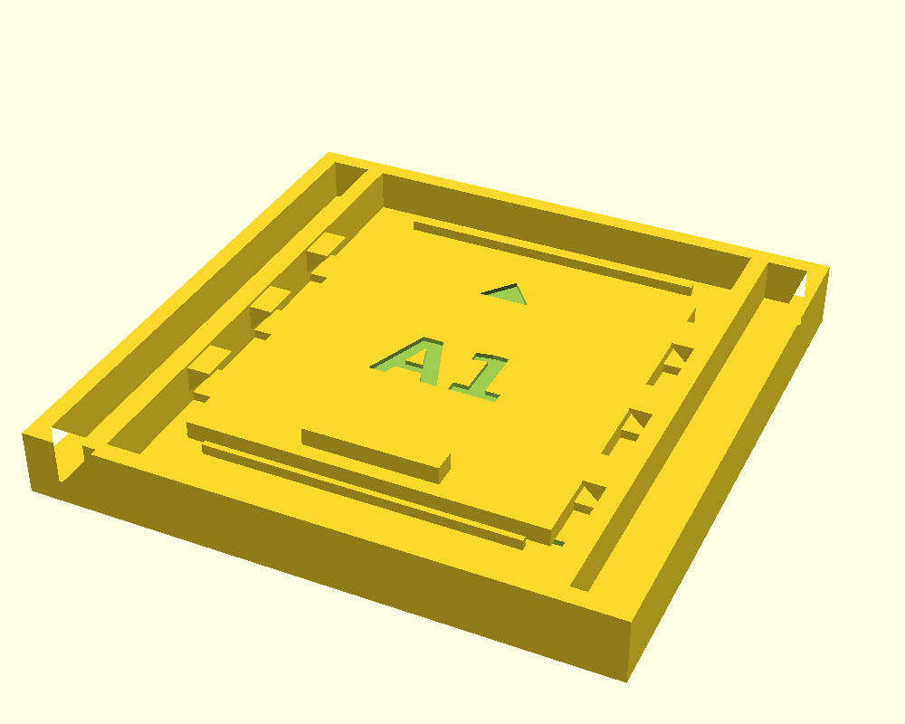
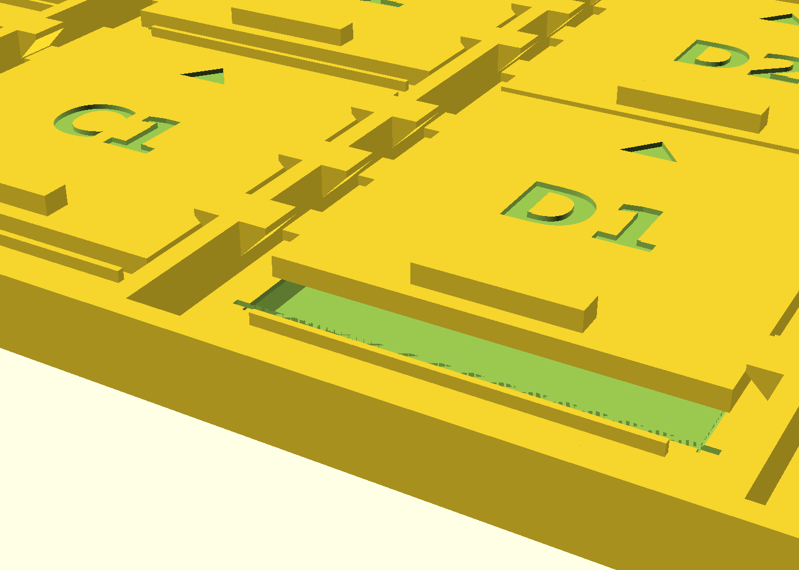

# sushi-battleship

## Previews



| Assembled (D1 opened) | Section through a shutter's middle tab |
|---|---|
|  |  |

| Slide-axis section (chamfers + ridge) | End-stop ridge gap close-up |
|---|---|
|  |  |



The 1×1 test coupon (`sushi-battleship-coupon.scad`) — print this
before the full board; see "Print this first" below.



Close-up: shutter D1 slid fully open (6.7 mm) — its side tabs now sit in
the gaps between the castellated rail lips, ready to lift straight out;
the strip visible through the revealed slice of window is the
sacrificial membrane. The cutaway faces a cut plane through a shutter's
middle tab: door plate floating 0.6 mm above the lid plate, tabs under
the 45°-chamfered lips (0.4 mm vertical / 0.5 mm horizontal clearance),
membrane down at bed level. Exact render commands for every preview are
in `previews/CAMERAS.md`; cameras stay fixed across review rounds.

## Goal

Battleship played with real sushi. Two printed parts:

- **bottom** — a tray with a 4×4 grid of cells (one cut roll piece per cell),
  low dividers to keep pieces in place, tall raised outer walls, and a
  rebated rim the lid drops into. Cell coordinates are engraved in each
  cell floor so ships can be placed by call-out.
- **top** — a lid with one **print-in-place sliding shutter per cell**
  (A1–D4). On a "hit" you slide the shutter ~6.7 mm toward the high row
  numbers until it stops, then lift it straight out to reveal (and eat)
  the piece below. Closed shutters are locked and cannot be lifted.

## Print this first: the coupon

`sushi-battleship-coupon.scad` is the full production lid at grid
1×1 — one complete shutter with its rails, castellated lips, end-stop
ridges, membrane and per-edge window chamfers, generated by the exact
code that builds the full board (~30–45 min print vs hours for the
top). Before committing to the full board:

1. Print the coupon with the settings from "Print settings" below.
2. Exercise it: free the door (one firm push toward the arrow), punch
   out the membrane, slide + lift the door out, drop it back in at the
   open position, slide forward to re-lock.
3. Door welded or sticky? Reprint the coupon with `door_fit = 0.1`,
   then 0.2, … (ceiling 0.5). Too rattly? Go −0.1 (floor −0.2).
   Asserts guard both the range and the remaining lip engagement.
4. Print the full top with your tuned `door_fit`. The knob only
   touches the door — lid and tray never change — so a re-tuned spare
   door (`sushi-battleship-door.scad`) also drops straight into an
   already-printed board.

## Given / assumed measurements

- Common cut roll piece (California-style futomaki): ~40 mm Ø × ~30 mm tall
  → `roll_d = 40`, `roll_h = 30`. Lid window is `roll_d + 6 = 46 mm`,
  cell pitch 58 mm, tray cell interior 56.4 mm (pitch − 1.6 mm divider) —
  comfortable buffer around a piece.
- Default 4×4 grid → lid 250 × 250 mm, tray 253.9 × 253.9 × 44.4 mm.
  Bed fit is per-printer and *profile*-dependent — see the bed-fit
  table under "Print settings" (stock Bambu X1/P1 profiles carve a
  front-left exclusion zone that clips even the 250 mm lid; the honest
  220 mm-bed answer is a 3×3 board at 192 mm). Reducing `roll_d` alone
  is not enough (`roll_d = 34` still yields a 226 mm lid on 4×4, and
  the shutter tab spacing stops working below `roll_d ≈ 35` — the
  assert hard-stops anything below ~34.9). Any grid size works; suggested "fleet" for
  4×4: one 3-piece roll, two 2-piece rolls, two single nigiri.

## Key decisions

- **Shutter mechanism**: bayonet slide-and-lift, not a full-travel slider.
  A shutter that slides fully open needs parking space equal to its own
  window, which would roughly double the board depth per row (a 4×4 board
  would exceed 400 mm). Instead each door carries 3 tabs per side that sit
  under castellated rail lips; sliding the door lines the tabs up with
  the gaps between lips, and the door lifts out (6.7 mm travel at
  defaults; tab escape margin `slide − tab_len` = 1.2 mm, slid-tab
  clearance to the next lip `tab_c − tab_len − slide` = 3.05 mm).
  Opening a cell = slide + lift, and the removed tile doubles as a hit
  marker. Doors drop back in at the open position and slide forward to
  re-lock.
- **Lift lock**: lips have 45° chamfered undersides (self-supporting, no
  drooping overhangs); tabs engage them with 2.7 mm of horizontal overlap
  and 0.4 mm vertical clearance.
- **End stops** (hardened in PR #3 round A): 1.4 mm ridges on every row
  boundary stop each door at full-open (so it doesn't hit the next row's
  door) and stop the next row's door from over-travelling forward past
  closed. The ridge sits a full `ridge_gap = clr_h` (0.5 mm) from the
  closed door's leading face — the original 0.2 mm construction gap was
  under one extrusion width, so every door's draped first-layer
  perimeter would spot-weld to it. Travel is derived as
  `slide = 2·m_y − ridge_w − ridge_gap` = 6.7 mm; the slid door's rear
  edge lands exactly on the ridge face, and the asserts track the
  formula (escape margin floor is 1 mm; defaults give 1.2 mm).
- **Under-door air gap `gap_z = 0.6`** (hardened in PR #3 round A; was
  0.4): the gap must survive slicer layer quantization with ≥ 2 air
  layers on *any* common preset, not just 0.2 mm. Guaranteed air layers
  (`floor(gap_z / layer_h)`):

  | layer height | 0.12 | 0.16 | 0.20 | 0.24 | 0.28 | 0.30 |
  |---|---|---|---|---|---|---|
  | `gap_z = 0.4` (old) | 3 | 2 | 2 | **1** | **1** | **1** |
  | `gap_z = 0.6` (now) | 5 | 3 | 3 | 2 | 2 | 2 |

  At one air layer the draped door first layer fuses on all 16 cells.
  Cost of 0.6: the freed door seats 0.6 mm lower than printed, so
  closed vertical rattle grows from 0.8 to 1.0 mm — accepted; a
  first print that works beats 0.2 mm less rattle.
- **Print-in-place strategy for the top**: doors print closed, `gap_z`
  above the plate. The door's first layer bridges its window in free
  air, anchored by the 1.2 mm plate strip under its front edge, the
  0.4 mm strip under its rear edge, ~0.5 mm under each long edge, and
  the six tab pads over the rails — so bridge strands *should* run
  along the slide axis between the end strips. The bridge angle is
  ultimately the slicer's choice, though: pin it (Bambu/Orca "Bridge
  direction" = 90° with the top as modeled; PrusaSlicer
  "Bridging angle") to make the slide-axis run a guarantee instead of
  a bet. After printing: free each door
  with one firm push toward the arrow, then punch the membranes out
  with a fingertip or knife.
- **Membrane role and punch-out aftermath** (comment corrected in PR #3
  round A; thickness moved onto the layer grid in round B): the
  membrane at the lid's *bottom* face does **not** support the door
  bridge — it sits ~3.4 mm below the door bottom. Its job is to catch
  drooped bridge strands so they can't wrap the window walls or dangle
  into the tray. `membrane = 0.2` is exactly one printed layer at the
  common presets; the old 0.3 landed mid-layer at 0.2 mm and could
  quantize into a two-layer skin — sixteen two-layer PLA punch-outs is
  a thumb workout, one layer is a fingertip poke per window (~a minute
  for the whole board). Punch-out burrs land on the window's underside
  rim facing the tray and cannot reach the slide path — cosmetic only.
  Printers with well-tuned bridging can set `membrane = 0` to omit it
  entirely (verified: the top still exports as 18 free bodies).
- **Door-only fit knob `door_fit`** (PR #3 round B): shrinks (+) or
  grows (−) the door body and tabs symmetrically while the lid and
  tray stay untouched, so fit is tunable by reprinting only the coupon
  or a spare door — never by re-printing (and thereby bricking) an
  already-printed board. Asserts hold it to −0.2 … +0.5 and require
  ≥ 1.5 mm of remaining lip engagement (defaults give 2.7 mm at
  `door_fit = 0`). Tuning loop documented under "Print this first".
- **Window lead-in chamfers are per-edge** (hardened in PR #3 round A;
  was a uniform 0.8 mm): the rear edge — the one the door's frozen
  bridge sag crosses when sliding — gets a 1.6 mm 45° ramp (tolerates
  sag to 2.2 mm below the door bottom before anything can jam). The
  front edge keeps 0.8 mm so the bridge-anchor strip under the door's
  front edge stays 1.2 mm wide (a uniform 1.6 mm chamfer would cut it
  to 0.4 mm and starve the bridge of its main anchor). The side edges
  get only a 0.3 mm edge break: the door never slides across them, and
  the smaller break leaves ~0.5 mm of landing under the door's long
  edges (the old 0.8 mm chamfer left exactly zero — chamfer mouth
  equalled `door_w` to the hundredth).
- **Wedge-cut lengths are chosen for mesh validity, not just coverage.**
  The old shared `opening + 2*d + 2` wedge length put each side wedge's
  end face exactly where the rear wedge's 45° underside crosses the
  side wedge's apex height (`chamfer_rear − chamfer_side` =
  `chamfer_side + 1`, i.e. 1.3 = 1.3 — an equality the round-A
  `chamfer_rear` 0.8→1.6 change created): the two cut volumes touched
  at a single point per rear window corner, and CGAL exported such a
  kiss as a zero-volume two-triangle shell — a non-manifold STL that
  failed printcheck's watertight gate. Side wedges now end at
  `opening/2 + (min(front, rear) − side)/2` — past the window wall but
  short of the apex-height crossing — so each end face is strictly
  contained inside the front/rear chamfer cuts instead of touching
  their boundaries; an assert enforces `chamfer_side <
  min(chamfer_front, chamfer_rear)` (a side break with a zero
  front/rear chamfer is no longer supported). Bonus: the old length
  also overshot the front chamfer mouth by 0.5 mm, shaving a 0.3 mm
  groove into the door's bridge-anchor landing at both front corners
  of every window — that material is back (visible in
  shutter-closeup.png with the door slid open; regenerated).
  Regression caveat: the point contact only degenerates where the
  rounded global cell coordinates collide exactly — on this board only
  row 2 produced slivers, and the 1×1 coupon renders the *old* code
  watertight — so the full-top render (what CI gates via `ci.parts`)
  is the only reliable regression check for this bug class, not the
  coupon.
- Doors are engraved with their coordinate and an arrow showing the slide
  direction; grip bar for pushing/pulling.
- Tray/lid fit: lid drops into a 3.4 mm rebate (0.35 mm/side clearance);
  thumb notches on left/right rim expose the lid edge for lifting it out.

## Print settings

Everything below is **derived** from geometry and stock slicer
profiles unless marked *(empirical)* — the coupon is the empirical
gate; print it first.

- **Orientation**: both parts flat side down, exactly as modeled
  (top: plate on bed; bottom: floor on bed).
- **Supports: OFF — hard requirement.** Any support material inside
  the windows or under the doors fuses the mechanism.
- **Nozzle: 0.4 mm.** The mechanism budgets 0.5 mm horizontal /
  0.4 mm vertical clearances; a 0.6 mm nozzle eats most of that in
  extrusion width — not recommended.
- **Layer height: 0.12–0.30 mm all safe** — every preset keeps ≥ 2 air
  layers under the doors (quantization table above), including mixed
  0.2 mm-first-layer draft profiles.
- **Material: PLA for the top.** Sixteen 46 mm free-air bridges in
  PETG is a sag lottery on a first print; if you do print the top in
  PETG, expect rougher door undersides, start at `door_fit = +0.1`,
  and max out part cooling on bridges. The tray can be any material.
- **Brim/skirt: none.** The board leaves ~1 mm of bed margin per side
  on 256-class beds. Bambu Studio's default brim is Auto (5 mm) — set
  it to No-brim; OrcaSlicer's default 1-loop skirt at 2 mm must also
  be turned off (Bambu stock profiles draw no skirt).
- **Bridge direction: pin to 90°** (strands along the slide axis, top
  as modeled): Bambu/Orca "Bridge direction" (`bridge_angle`, 0 =
  auto), PrusaSlicer "Bridging angle". Auto scoring on a near-square
  window can legitimately pick the cross or diagonal direction, whose
  anchors are far weaker.
- **Seam: "Back"** (or scarf seam, Bambu Studio ≥ 1.9): points each
  door's seam artifact at the deep rear chamfer. The default Aligned
  seam stacks 16 door seams onto mating edges.
- **If doors still weld on the coupon**: check "slice gap closing
  radius" (the classic Bambu culprit for fused print-in-place gaps —
  it must not exceed the ~0.049 mm default), then step `door_fit`
  up by +0.1.
- **Bed fit, per printer** (derived from stock machine profiles, not
  yet test-printed on each machine):

  | printer (stock profile) | usable bed | 4×4 board (tray 253.9 / lid 250) | if it doesn't fit |
  |---|---|---|---|
  | Bambu P2S | full 256 × 256 (`bed_exclude_area` empty) | fits | — |
  | Bambu X1 / P1 series | 256² minus an 18 × 28 mm front-left exclusion zone | does **not** fit centred — the cutout clips the board and there is no room to shift 18 mm off-centre | 3×3 (192 mm), or knowingly edit the printable area |
  | Bambu H2 class (H2C/H2D/H2S) | ≥ 300 × 320 (incl. H2C dual-nozzle common area) | fits | — |
  | Prusa CORE One | 250 × 220 | does not fit (250 mm lid > 220 mm depth) | 3×3 (192 mm) |
  | generic 220-class (Ender 3 etc.) | 220 × 220 | does not fit | 3×3 (192 mm) |
  | 300-class and larger | ≥ 300 × 300 | fits | — |

- Food contact: FDM prints are not dishwasher-safe or truly food-safe;
  serve pieces on nori/parchment squares or in silicone cups, or seal the
  tray with a food-safe epoxy if it will touch food directly.

## Rendering

`./scripts/render.sh sushi-battleship` renders the assembled preview
(default `part="assembled"`, one shutter shown open). Printable exports:

```bash
xvfb-run -a openscad -o build/sushi-battleship-top.stl    designs/sushi-battleship/sushi-battleship-top.scad
xvfb-run -a openscad -o build/sushi-battleship-bottom.stl designs/sushi-battleship/sushi-battleship-bottom.scad
xvfb-run -a openscad -o build/sushi-battleship-door.stl   designs/sushi-battleship/sushi-battleship-door.scad
```

(or `-D 'part="top"'` etc. on the main file). The top must export with
**18 CGAL volumes** (outer space + lid + 16 doors) — that's the check that
every door is a separate, free body.

## Mesh hygiene: engine-proof unions (2026-08-02)

Moving CI renders to the Manifold backend surfaced kiss contacts CGAL had
been fusing silently: the lid's rail walls and end-stop ridges sat at
exactly `z = plate_t` and the castellated lips met the rail faces exactly,
so the Manifold export fractured the lid into 25 coincident shells
(41 bodies total, non-manifold STL). All three features are now buried
`eps` (0.01 mm) into their mating body — same idiom the tray dividers and
door grip bar already used. No external dimension changed; the top still
exports as lid + 16 free doors (17 shells, 18 CGAL volumes) and must stay
watertight under BOTH engines — CI checks Manifold, `gate.sh` locally
typically checks CGAL.

Round 2: burial alone left 288 non-manifold edges at the lip tops
(printcheck's cluster report pinpointed x = rail faces, z = rail top) —
lip tops exactly coplanar with the rail top are a shared-plane strip that
Manifold exports as a seam and CGAL as 192 zero-area triangles. Lips now
stop `lip_top_drop` (0.4 mm) below the rail top; the filler web above the
lip slope is non-functional, engagement geometry unchanged. CGAL export
now has ZERO degenerate triangles (was 192) and the top scores 84/100.
Rule of thumb going forward: no feature may share an exact plane or face
with a sibling it isn't eps-buried into.
