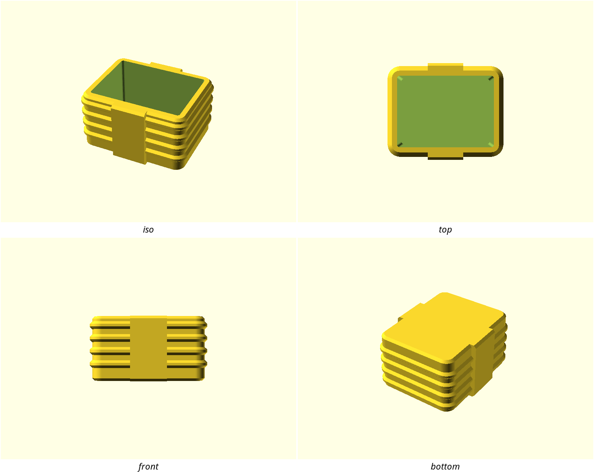

# Ribbed Industrial

Utility housings that look machined rather than printed: walls articulated with
fine horizontal fins, a smooth band where your hand goes, and every edge cut
back at 45 degrees. It is a style with one governing idea — **nothing on the
part is shallower than 45 degrees**, so nothing needs support — and everything
else follows from it.



## Where it comes from

- `compressor-box.stl` — sha256 `b33a17f369b5cc01…`
- `compressor-box-lid.stl` — sha256 `61a32a87401bbb74…`
  - source: Clockspring3D "819 Compressor Box", box and lid, supplied by the
    repo owner
  - licence: **personal use, no redistribution**

The reference is somebody else's work and is licensed for personal use, so it
is **not committed here** — not the meshes, and not renders of them. The hashes
above identify exactly which files were measured; every number on this page was
derived from them locally and can be re-derived by anyone holding the same two
files. What is committed is our own `swatch.scad` and the render of it above.

**Why this reference is also a warning.** `stylelift lift` proposed six rules
from these meshes and four of them were wrong, in ways worth knowing about:

- It offered a **corner radius of 1.577 mm**, carrying 43% of the curved edge
  length. That is not a corner radius at all — it is the rib profile read back
  as an arc, and it falls out of the profile exactly:
  `((1.4142 flank + 1.0 crest) / 2) / (2·sin 22.5°) = 1.5772`. The real plan
  corner radius is **4.000 mm**, which had to be measured directly by fitting
  the corner arc between its tangent points, *in a rib valley* — fit it at a
  crest and you get 5.000 mm, because the rib's 1 mm relief carries the corner
  out with it.
- It offered a **fastener vocabulary of a 98.39 mm hole** on an "oblique" axis.
  There is no such hole; that is the outer form being read as a cylinder. The
  reference has no fastener holes at all, so this style has no `hole_d` token.
- It offered `$fn ≈ 16` from that same rib-crest artifact, and a `bbox_fill`
  rule that describes this box being a box.

All four were deleted by hand. The measuring is exact; deciding which numbers
are the family is a judgement call, and it stays yours.

## The rules

What a new design must do to belong to this family. `stylelift check` enforces
these against the design's exported STL; a rule whose precondition does not
apply to a given part is skipped, not failed.

<!-- stylelift:rules -->
| Rule | Requirement | Severity | Why |
|---|---|---|---|
| `edge-break` | `edges.chamfers.dominant_leg_mm` = 1 ±30% | required | every edge in this family is broken by the same 1 mm 45-degree cut. Length-weighted, the 1.0 mm leg carries 83% of the box's chamfer band length and is the lid's largest single size too; it also appears at 0.9958 mm on an unrelated design by the same hand. The +-30% band is set by what the metric actually reports rather than by the design intent: dominant_leg_mm is an unweighted median over every band, so the lid reads 1.2112 despite being a 1 mm part. Wide enough for that artifact, still narrow enough to reject a 0.6 mm-chamfer family |
| `breaks-its-edges` | `edges.chamfers.count` ≥ 8 | required | a part with no 45-degree breaks at all is not in this family, whatever size its chamfers would have been; the reference carries 260 bands on the box and 291 on the lid, so 8 is a floor no real part in the style can fall below |
| `support-free` | `orientation.unsupported_share` ≤ 0.1 | required | the discipline the whole style is built on: no downward surface sits shallower than 45 degrees. The box needs support on 0.66% of its surface and the lid on 6.93%, against a limit of 10% that leaves room for one honest bridge |
| `chunky-sections` | `walls.p05_mm` ≥ 2 | required | nothing in this family is thin — the box's 5th-percentile section is 2.5 mm and the lid's 3.18 mm. Ribs read as machined only on a wall heavy enough to carry them |
| `chamfer-grammar` | `edges.grammar.chamfered_share` ≥ 0.03 | advisory | this family cuts where other families fillet (5.6% of the box's shaped edge length, 11.5% of the lid's). A share of edge length, which falls as a part grows, so advisory |
| `upright-walls` | `orientation.vertical_share` ≥ 0.3 | advisory | the form is made of upright walls meeting flat tops, not a sloping shell — 57% of the box's surface is vertical and 35% of the lid's. Advisory because a lid is mostly lid |
<!-- /stylelift:rules -->

The four required rules are all about **treatment and discipline**, which do
not change with the size of the part. The two advisory ones are shares of
surface or edge length, which fall as a part grows — a big tray in this family
should not be failed for being big.

**What these rules cannot check.** Nothing here verifies that a part is
actually *ribbed*. `stylelift` has no periodicity metric, so a smooth box with
its edges correctly broken will pass every rule above. The ribs live in the
tokens instead: build from them and you get them right, ignore them and the
gate will not catch you. This is the honest limit of the pack, and the swatch
is what demonstrates the intended result.

## Tokens

Numbers to build with. `include <styles/ribbed-industrial/style.scad>` and use
these rather than retyping the values — a design written from the tokens passes
the rules by construction.

<!-- stylelift:tokens -->
| Token | Value | What it is |
|---|---|---|
| `style_corner_r` | 4 mm | radius of the family's rounded edges |
| `style_edge_chamfer` | 1 mm | leg length of the family's chamfers |
| `style_wall` | 3 mm | material thickness the family builds at |
| `style_fn` | 64 segments | curve resolution ($fn) the family draws at |
| `style_max_overhang_deg` | 45 | defined by this style — see the prose below |
| `style_rib_crest` | 1 | defined by this style — see the prose below |
| `style_rib_depth` | 1 | defined by this style — see the prose below |
| `style_rib_pitch` | 5 | defined by this style — see the prose below |
<!-- /stylelift:tokens -->

The four rib tokens describe one period of the wall articulation, measured off
the reference to the micron:

```text
    pitch 5.000 mm  =  root 2.0  +  flank 1.0  +  crest 1.0  +  flank 1.0
    depth 1.000 mm     flanks at exactly 45.000 degrees

    every number on the part is a multiple of 1 mm:
        wall 3    corner radius 4    rib pitch 5    rib depth 1    break 1
```

That is the whole trick. Because the flank rise equals the flank run, the ribs
print without support in any orientation the walls are upright in.

## Measured evidence

<!-- stylelift:evidence -->
| Property | Reference |
|---|---|
| Edge softness | 0.55 (1.0 = every edge curves) |
| Edge grammar | rounded 59% / chamfered 6% / sharp 35% |
| Rounding vocabulary | 1.5772 mm (43%), 7.8945 mm (14%), 13.1231 mm (8%) |
| Form curvature (the shape, not its edges) | 41 mm |
| Chamfer leg | 1 mm |
| Fills its bounding box | 17% |
| Round feature | 1 x hole 98.4 mm diameter, oblique axis |
| Round feature | 1 x hole 99.4 mm diameter, oblique axis |
<!-- /stylelift:evidence -->

Read this table with the warning above in mind: the "rounding vocabulary" is
dominated by rib-crest roundings, and the two ~98 mm "holes" are the tool
reading the outer form as a cylinder. The rows that carry the style are the
**1 mm chamfer leg** and the edge grammar.

Measured directly rather than by `stylelift`, because no metric reports them:

| Property | Reference |
|---|---|
| Rib pitch | 5.000 mm (sd 0.000 across 13 periods, on every wall) |
| Rib depth | 1.000 mm (crest at 49.000, root at 48.000) |
| Rib flank angle | 45.0 degrees |
| Plan corner radius | 4.000 mm at a rib valley, 5.000 mm at a crest (rms 0.008 mm against each; the alternative hypothesis misses by 10.3 mm and 0.39 mm respectively) |
| Wall thickness | 3.000 mm, identical at every height and position |
| Rib field termination | end crests are 2.000 mm tall against 1.000 mm for the 14 between them — the field is deliberately capped, not run off the edge |
| Window slots (lid) | true stadiums 4.000 mm wide at 8.333 mm pitch, ~50% open |
| Surface needing support | 0.66% of the box, 6.93% of the lid |

## Designing in this style

```scad
include <styles/ribbed-industrial/style.scad>
$fn = style_fn;
```

**Do**

- Break **every** edge at `style_edge_chamfer` — 45 degrees, never a fillet. It
  is the one number that recurs across unrelated designs by this hand, and it
  is what makes a part read as belonging.
- Articulate the walls with ribs at `style_rib_pitch`, `style_rib_depth` deep,
  flanks at 45 degrees. Build each flank by hulling between two plans whose
  offsets differ by exactly the height between them — that construction *is* the
  45 degrees, and it cannot drift (see `swatch.scad`).
- Leave a smooth band where a hand grips the part, standing proud of the rib
  crests. The ribs are for the eye; the band is for the thumb.
- Round the plan at `style_corner_r` — that is the radius of the *wall*, and
  the ribs carry it out to 5 mm at their crests on their own. Keep walls at
  `style_wall` or heavier: a thin wall makes ribs look like ripples, not fins.
- Cap the rib field top and bottom with a double-height crest rather than
  letting the last rib die into a flat. The reference does this on both ends.
- Where a wall becomes a window array, make the openings true stadiums — 
  parallel sides closed by semicircular ends — not rounded rectangles, and
  leave the wall about half open.
- Design so `orientation.unsupported_share` is near zero. If a feature needs a
  transition, make it a 45-degree ramp, not a shallow one and not a bridge.

**Don't**

- Don't fillet an edge that could be chamfered. This family cuts.
- Don't let any downward face fall below 45 degrees from the bed. That is the
  rule the whole style exists to express, and it is the one CI enforces most
  strictly.
- Don't rib a face that will be gripped, screwed against, or labelled — ribs
  belong on free faces.
- Don't scale the rib pitch with the part. A bigger box gets *more* ribs at
  5 mm, not the same number of bigger ones; that is what keeps a large part and
  a small part in the same family.
- Don't add supports to the print. If a part in this style needs them, the
  geometry is wrong, not the slicer.

## What the mesh cannot tell you

Asserted by a human and recorded in `style.json` under `asserted` — half of
what makes a style recognisable never reaches the geometry:

- **Material / colour:** opaque PLA or PETG. The reference is printed as a
  two-colour *assembly* — body one colour, lid another — never one part in two
  colours.
- **Finish:** printed as-is. Layer lines are part of the look, and they run
  parallel to the ribs, which is why the walls read as machined.
- **Suits:** shop and desk housings that get picked up — boxes, caddies, lidded
  containers, anything with a lid or a moving part.
- **Non-goals:** not a display style. No supports, no sculpted relief, no text
  on visible faces, no fillet where a chamfer will do.

## Swatch

`swatch.scad` is a small ribbed housing written in this style, and the style's
own regression test. `./scripts/style-check.sh ribbed-industrial` renders it and
checks it against the rules above, so a spec that no part can satisfy fails
loudly instead of sitting on the shelf being wrong. It currently measures
`unsupported_share = 0` — not a rounding of a small number, but no
support-needing surface at all.

To hold your own design to this style, either declare it in
`designs/<name>/style.conf` (CI then checks every printable part on each push)
or run the check directly:

```bash
stylelift check build/<part>.stl --style styles/ribbed-industrial
```
