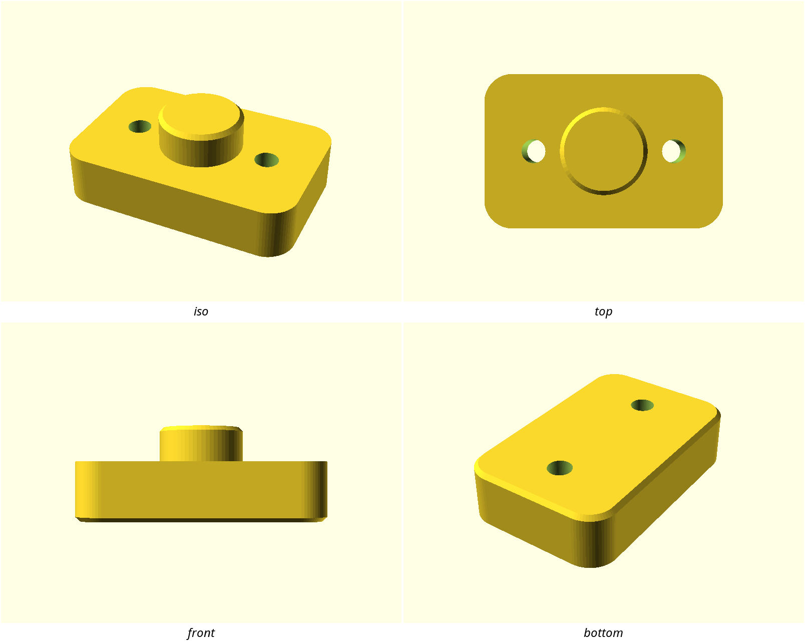

# Workshop Utility

Parts that get bolted to something and handled every day: generously rounded
boxes, a 45-degree break on every bed edge, M3 clearance holes, and curves
smooth enough that nobody sees a facet. Nothing decorative, nothing that needs
supports.



## Where it comes from

- `style-ref-workshop-utility.stl` — sha256 `d0ebb20bd12489b0…`
  - source: rendered in-repo with
    `OPENSCADPATH=lib:. openscad -o build/style-ref-workshop-utility.stl -D '$fn=64' lib/printability-demo.scad`
  - author / license: this repository (MIT)

The reference is this repo's own `lib/printability-demo.scad` — the plate that
shows one of each FDM helper. That makes it an honest statement of the house
style: whatever `lib/printability.scad` does by default *is* what designs here
look like, and now that is written down and checkable. A style lifted from
somebody else's model works the same way, with one extra obligation: record
where it came from and under what licence, and don't commit their mesh unless
the licence allows it. The hash above identifies the reference; every number on
this page was measured from it.

**Why this reference is also a warning.** It is a plate of five separate
bodies, so the whole-part measurements — how much of its bounding box the form
fills, what its "wall thickness" is — describe the arrangement of a demo, not
the style. `stylelift lift` proposed tokens for both; both were deleted by hand
before this pack was committed. The measuring is exact, but deciding which
numbers are the family is a judgement call, and it stays yours.

## The rules

What a new design must do to belong to this family. `stylelift check` enforces these against the design's exported STL; a rule whose precondition does not apply to a given part is skipped, not failed.

<!-- stylelift:rules -->
| Rule | Requirement | Severity | Why |
|---|---|---|---|
| `corner-radius` | `edges.rounding.dominant_r_mm` = 4 ±35% | required | the family reuses one radius (4 mm) on its rounded edges; a part that rounds at a different scale reads as a different family |
| `curve-smoothness` | `edges.rounding.implied_fn` ≥ 44 | required | curves in this family are drawn at about $fn=64; visibly faceted curves break the family look |
| `chamfer-size` | `edges.chamfers.dominant_leg_mm` = 0.6 ±40% | advisory | chamfers in the reference are cut at about 0.6 mm |
| `soft-edges` | `edges.softness` ≥ 0.474 | advisory | this is a soft family: most of its edge length curves rather than turning a corner (a share of edge length, which falls as a part grows at fixed radius — advisory so a big tray in this family is not failed for being big) |
| `grammar-rounded` | `edges.grammar.rounded_share` ≥ 0.443 | advisory | the reference treats 74% of its shaped edge length as rounded; that is the family's dominant edge grammar (a share of edge length, which falls as a part grows at fixed radius — advisory so a big tray in this family is not failed for being big) |
| `hole-vocabulary` | `features.dominant_hole_d_mm` = 3.4 ±12% | advisory | the family's fastener vocabulary is a 3.4 mm hole; mixing fastener sizes across a family is what makes a set of parts feel unrelated |
<!-- /stylelift:rules -->

The tolerances are wide on purpose. A 20 mm bracket and a 200 mm tray both
belong to this family, and a rule tight enough to fail one of them would teach
everybody to ignore the checker.

## Tokens

Numbers to build with. `include <styles/workshop-utility/style.scad>` and use these rather than retyping the values — a design written from the tokens passes the rules by construction.

<!-- stylelift:tokens -->
| Token | Value | What it is |
|---|---|---|
| `style_corner_r` | 4 mm | radius of the family's rounded edges |
| `style_edge_chamfer` | 0.6 mm | leg length of the family's chamfers |
| `style_hole_d` | 3.4 mm | the family's fastener clearance hole |
| `style_fn` | 64 segments | curve resolution ($fn) the family draws at |
| `softness` | 0.79 | target the checker compares against, not a number you build with |
<!-- /stylelift:tokens -->

## Measured evidence

<!-- stylelift:evidence -->
| Property | Reference |
|---|---|
| Edge softness | 0.80 (1.0 = every edge curves) |
| Edge grammar | rounded 53% / chamfered 8% / sharp 38% |
| Rounding vocabulary | 4.0017 mm (100%) |
| Form curvature (the shape, not its edges) | 4.4 mm |
| Chamfer leg | 0.6 mm |
| Fills its bounding box | 29% |
| Round feature | 3 x hole 3.4 mm diameter, z axis |
| Round feature | 1 x hole 4 mm diameter, z axis |
| Round feature | 1 x hole 6 mm diameter, z axis |
| Round feature | 1 x boss 8.8 mm diameter, z axis |
<!-- /stylelift:evidence -->

One radius carries 98% of the reference's curved edge length. That single
number is the style: this family picks a radius and reuses it everywhere,
rather than sizing each fillet to the edge it lands on.

## Designing in this style

```scad
include <styles/workshop-utility/style.scad>
use <printability.scad>

$fn = style_fn;

rounded_box([w, d, h], r = style_corner_r, bottom_chamfer = style_edge_chamfer);
```

**Do**

- Round every vertical edge at `style_corner_r`, even on a small part — the
  radius does not scale with the part, which is exactly what makes the family
  read as a family.
- Break every bed-contact edge with `style_edge_chamfer` at 45°, never a
  fillet: a chamfer prints without drooping, a first-layer fillet does not.
- Use `screw_hole("M3", …)` from `lib/printability.scad` for fasteners, and
  counterbore rather than countersink when a head has to sit flush.
- Give bosses and posts the same 0.6 mm break on their top edge.

**Don't**

- Don't mix fastener sizes across parts that get used together.
- Don't drop `$fn` below 64 on anything visible; a faceted 4 mm radius reads as
  a mistake rather than a choice.
- Don't add ribs, text, or relief to visible faces — this style is plain, and
  the uninterrupted top face is what makes it look deliberate.
- Don't design anything that needs supports.

## What the mesh cannot tell you

Asserted by a human and recorded in `style.json` under `asserted` — half of
what makes a style recognisable never reaches the geometry:

- **Material / colour:** opaque PLA or PETG, one colour per part.
- **Finish:** printed as-is — layer lines visible, no sanding or filler.
- **Suits:** shop fixtures, mounts, organisers.
- **Non-goals:** not a display style. No thin decorative ribs, no text on
  visible faces, nothing that needs supports.

## Swatch

`swatch.scad` is a small part written in this style — a mounting pad, and the
style's own regression test. `./scripts/style-check.sh workshop-utility`
renders it and checks it against the rules above, so a spec that no part can
satisfy fails loudly instead of sitting on the shelf being wrong.

To hold your own design to this style, either declare it in
`designs/<name>/style.conf` (CI then checks every printable part on each push)
or run the check directly:

```bash
stylelift check build/<part>.stl --style styles/workshop-utility
```
